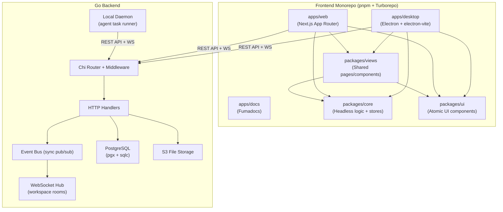
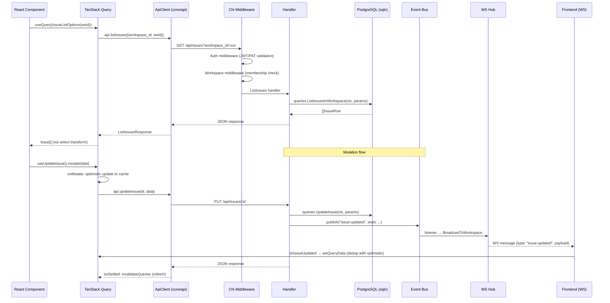
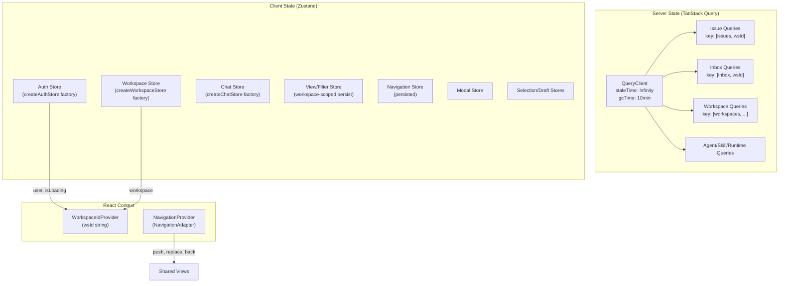
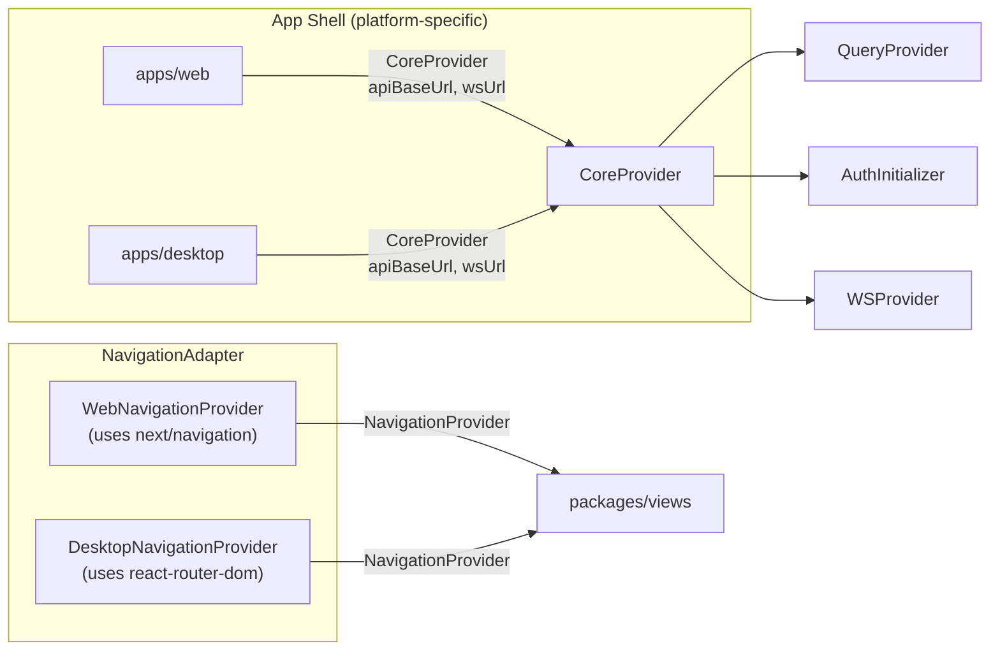
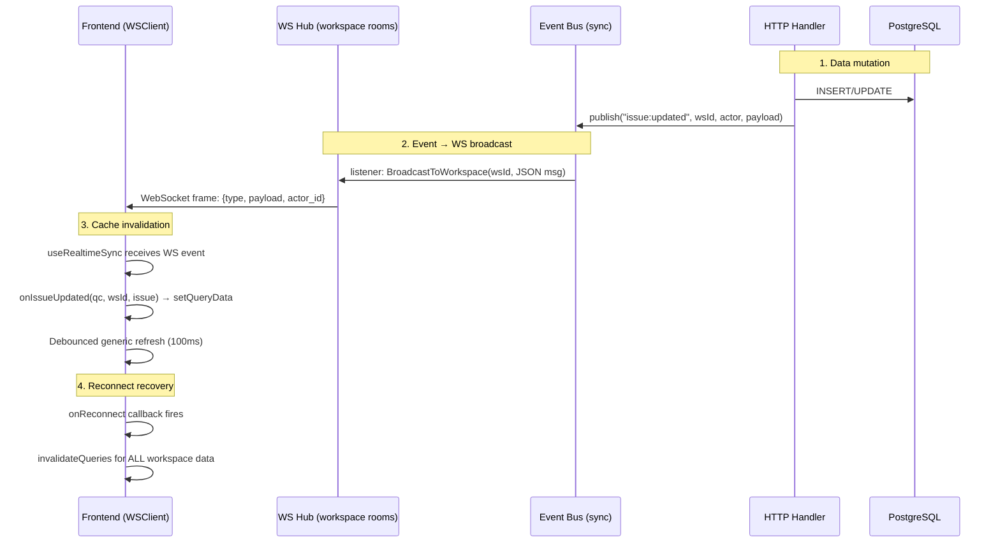
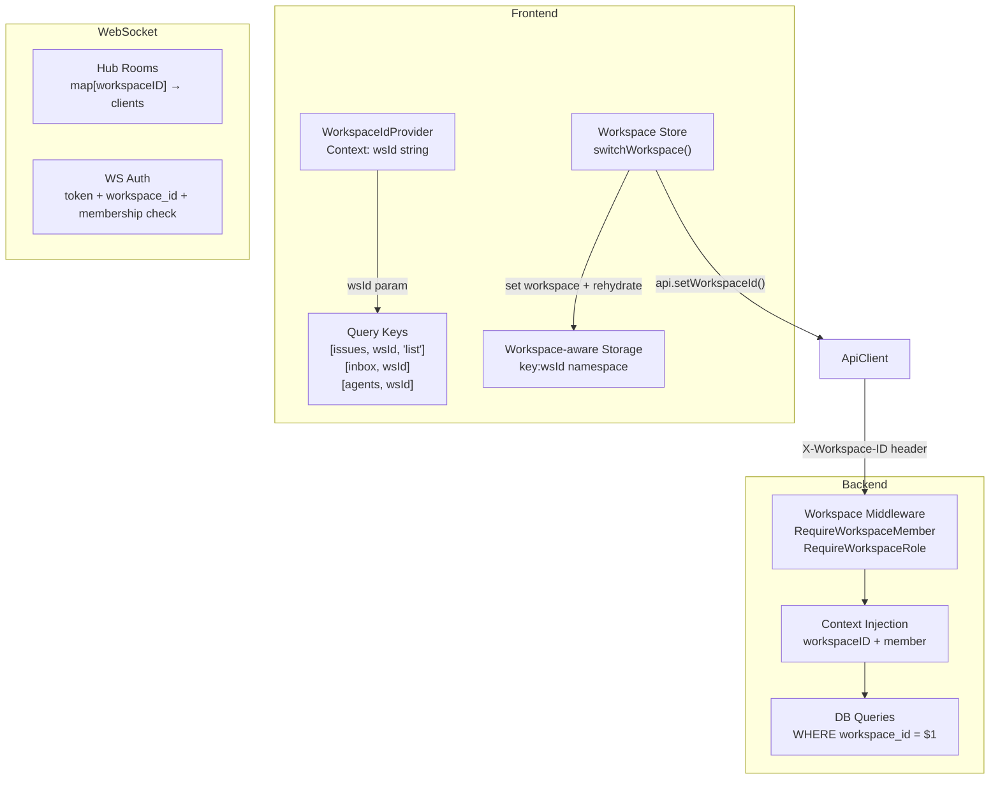
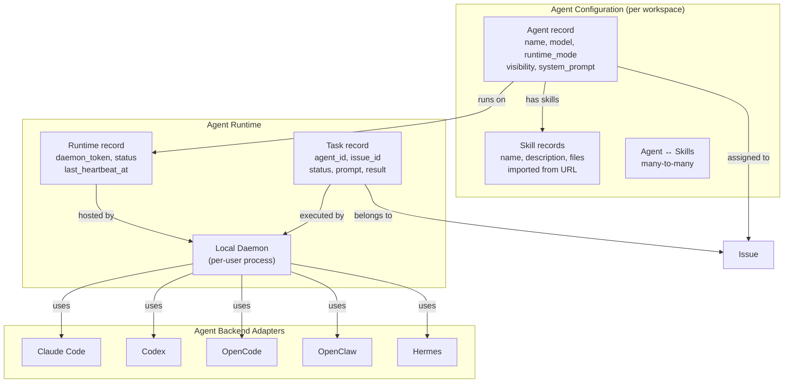

# Architecture

**Analysis Date:** 2026-04-13

## Pattern Overview

**Overall:** Full-stack monorepo with Go backend, cross-platform TypeScript frontend (pnpm workspaces + Turborepo), and local daemon for AI agent task execution.

**Key Characteristics:**
- **Internal Packages Pattern** — shared packages export raw `.ts`/`.tsx` files (no pre-compilation); consuming apps' bundlers compile them directly for zero-config HMR and instant go-to-definition.
- **Cross-Platform Bridge** — `@multica/core` contains all headless business logic; `@multica/views` contains all shared UI pages; apps (`web`, `desktop`) are thin shells that provide routing and platform adapters.
- **Event-Driven Real-Time** — Go backend uses an in-process event bus; handlers publish domain events; a WebSocket Hub broadcasts to workspace rooms; the frontend invalidates TanStack Query caches.
- **Multi-Tenant Workspace Isolation** — every API query is scoped by `workspace_id`; middleware enforces membership; TanStack Query keys embed `wsId` for automatic cache partitioning.



上图展示了系统的整体分层结构。前端采用 pnpm monorepo 组织为三个应用和三个共享包，通过 REST API 和 WebSocket 与 Go 后端通信。Go 后端使用 Chi 路由器、事件总线和 PostgreSQL 数据库，并支持本地 Daemon 执行 AI 代理任务。

---

## Layers

### Frontend: Platform Shell Layer
- Purpose: 应用入口，提供平台特定适配（路由、存储、认证回调）
- Location: `apps/web/`, `apps/desktop/`
- Contains: 路由定义、平台 Provider 包装、平台专属页面（landing page）
- Depends on: `@multica/core`, `@multica/views`, `@multica/ui`
- Used by: End user (browser or desktop app)

### Frontend: Shared Views Layer
- Purpose: 跨平台共享的业务页面和组件（零框架依赖）
- Location: `packages/views/`
- Contains: 页面组件（IssuesPage, InboxPage, SettingsPage 等）、布局组件、模态框、编辑器
- Depends on: `@multica/core`, `@multica/ui`
- Used by: Platform shell layer (apps)
- Constraint: 零 `next/*` 导入，零 `react-router-dom` 导入，零 Zustand store 直接定义

### Frontend: Headless Core Layer
- Purpose: 纯业务逻辑（stores、queries、mutations、API client、WS client）
- Location: `packages/core/`
- Contains: Zustand stores、TanStack Query 定义、ApiClient、WSClient、类型定义
- Depends on: `zustand`, `@tanstack/react-query`（peer: `react`）
- Used by: `packages/views/`, both apps
- Constraint: 零 `react-dom`，零 `localStorage` 直接访问（使用 StorageAdapter），零 `process.env`，零 UI 库

### Frontend: Atomic UI Layer
- Purpose: 纯 UI 原子组件（零业务逻辑）
- Location: `packages/ui/`
- Contains: shadcn 组件（Base UI 变体）、Markdown 渲染、样式 token、工具函数
- Depends on: `@base-ui/react`, `lucide-react`, `tailwind-merge` 等（peer: `react`, `react-dom`）
- Used by: `packages/views/`, both apps
- Constraint: 零 `@multica/core` 导入

### Backend: Handler Layer
- Purpose: HTTP 请求处理、参数验证、权限检查
- Location: `server/internal/handler/`
- Contains: 每个 domain 的 HTTP handler（`issue.go`, `agent.go`, `workspace.go` 等）
- Depends on: `server/pkg/db/generated`（sqlc）、`events.Bus`、`realtime.Hub`
- Used by: Chi router

### Backend: Domain Event Layer
- Purpose: 同步事件总线，解耦 handler 和副作用（通知、WS 广播）
- Location: `server/internal/events/`（Bus 定义），`server/cmd/server/`（listener 注册）
- Contains: `Event` struct、`Bus`（sync pub/sub）
- Depends on: 无外部依赖
- Used by: Handlers 发布事件，listeners 处理事件

### Backend: Real-Time Layer
- Purpose: WebSocket 连接管理、按 workspace 分组广播
- Location: `server/internal/realtime/`
- Contains: `Hub`、`Client`、`HandleWebSocket` 升级函数
- Depends on: `gorilla/websocket`
- Used by: Event listeners 广播消息

### Backend: Data Access Layer
- Purpose: 类型安全的 SQL 查询
- Location: `server/pkg/db/`（queries/ 为手写 SQL，generated/ 为 sqlc 输出）
- Contains: 每张表的 `.sql` 查询文件和对应的 Go 代码
- Depends on: `pgx/v5`
- Used by: Handlers, services

### Backend: Daemon Layer
- Purpose: 本地 AI 代理运行时，轮询并执行任务
- Location: `server/internal/daemon/`
- Contains: Daemon 主循环、agent backend 适配器（Claude、Codex、OpenCode 等）、repo 缓存
- Depends on: `server/pkg/agent`、`server/internal/daemon/execenv`
- Used by: CLI (`make daemon`)

---

## Data Flow

### Request Lifecycle (Frontend → API → Database → Response)



上图展示了一个完整的请求-响应生命周期。读取操作通过 TanStack Query 触发 API 调用；写入操作首先执行乐观更新（optimistic update），然后发送 API 请求，handler 在写库后通过事件总线发布领域事件，最终通过 WebSocket 广播给同一 workspace 的所有客户端，客户端收到后更新 Query 缓存。

### State Management Architecture



上图展示了三种状态管理机制及其关系。TanStack Query 管理所有服务端数据（staleTime 设为 Infinity，依赖 WS 事件触发 invalidation）；Zustand 管理客户端 UI 状态（通过 factory + Proxy 单例模式）；React Context 提供跨切面的平台管道（workspace ID 和导航适配器）。

**Key rules:**
- TanStack Query: `staleTime: Infinity`, `gcTime: 10min`, `refetchOnWindowFocus: false`, `refetchOnReconnect: true`
- Never duplicate server data into Zustand stores
- All workspace-scoped queries must key on `wsId`
- Mutations are optimistic by default (apply locally, rollback on error, invalidate on settle)
- WS events invalidate queries — they never write to stores directly
- Only auth and workspace stores may call `api.*` directly

### Store Registration Pattern (Factory + Proxy Singleton)

```typescript
// packages/core/auth/store.ts — Factory function
export function createAuthStore(options: AuthStoreOptions) {
  return create<AuthState>((set) => ({
    user: null,
    isLoading: true,
    initialize: async () => { /* ... */ },
    // ...
  }));
}

// packages/core/auth/index.ts — Module-level singleton via Proxy
let _store: AuthStoreInstance | null = null;
export function registerAuthStore(store: AuthStoreInstance) { _store = store; }
export const useAuthStore: AuthStoreInstance = new Proxy(/* ... */);
```

`packages/core/platform/core-provider.tsx` 在 `initCore()` 中创建 store 实例并注册：
1. `createAuthStore({ api, storage, onLogin, onLogout })` — 创建带依赖注入的 store
2. `registerAuthStore(authStore)` — 注册到模块级 Proxy 单例
3. 所有消费方通过 `useAuthStore(selector)` 或 `useAuthStore.getState()` 访问

同样模式适用于 Workspace Store (`packages/core/workspace/index.ts`) 和 Chat Store (`packages/core/chat/index.ts`)。

---

## Platform Bridge Pattern



上图展示了平台桥接模式。每个应用在根组件中用 `CoreProvider` 包装（注入 API URL、WS URL、storage adapter 和登录/登出回调）。导航适配器（`NavigationAdapter`）是应用提供的唯一接口，让共享 views 包无需了解底层路由框架。

**CoreProvider initialization chain** (`packages/core/platform/core-provider.tsx`):
1. `initCore()` — 创建 ApiClient、AuthStore、WorkspaceStore、ChatStore（单例，仅一次）
2. `<QueryProvider>` — 初始化 TanStack QueryClient
3. `<AuthInitializer>` — 从 storage 读取 token，调用 `api.getMe()` + `api.listWorkspaces()`，初始化 auth/workspace state
4. `<WSProvider>` — 当 user + workspace 就绪后建立 WebSocket 连接，注册 realtime sync

**NavigationAdapter interface** (`packages/views/navigation/types.ts`):
- Web: `apps/web/platform/navigation.tsx` — wraps `next/navigation` (useRouter, usePathname, useSearchParams)
- Desktop: `apps/desktop/src/renderer/src/platform/navigation.tsx` — wraps react-router-dom memory router per tab

---

## Real-Time Architecture



上图展示了实时数据同步的完整流程。数据变更通过事件总线同步传播到 WebSocket Hub，Hub 按 workspace ID 广播给房间内的所有连接。前端收到 WS 消息后直接更新 TanStack Query 缓存（精确更新）或触发 invalidation（通用刷新），避免轮询。

**WSClient** (`packages/core/api/ws-client.ts`):
- 自动重连（3 秒间隔）
- 按事件类型注册 handler (`ws.on("issue:updated", handler)`)
- 支持 `onAny` 全局监听
- 重连时触发 `onReconnect` 回调

**useRealtimeSync** (`packages/core/realtime/use-realtime-sync.ts`):
- 精确 handler：`issue:created/updated/deleted`、`inbox:new`、`comment:*`、`activity:created`、`reaction:*`、`subscriber:*`
- 通用 handler：按事件前缀（`inbox:`, `agent:`, `member:` 等）做 debounced invalidation（100ms）
- 副作用 handler：`workspace:deleted`、`member:removed`（清理 storage + 切换 workspace）
- 不做 self-event 过滤：`actor_id` 标识用户而非标签页，过滤会阻止同一用户多标签页同步

**Event Bus** (`server/internal/events/bus.go`):
- 同步执行，按注册顺序
- 类型特定 handler 先执行，全局 handler 后执行
- 单个 handler panic 不影响其他 handler（recover）

**WS Hub** (`server/internal/realtime/hub.go`):
- 按 workspace ID 组织连接为 rooms
- 支持 `BroadcastToWorkspace`、`SendToUser`（跨 workspace）、`Broadcast`（全局）
- 慢客户端自动踢出（send channel 满 256 buffer）

---

## Multi-Tenancy Architecture



上图展示了多租户隔离的完整链路。前端通过 `WorkspaceIdProvider` 提供当前 workspace ID，所有 TanStack Query key 都嵌入 wsId 实现缓存分区。后端通过中间件强制检查 workspace 成员身份，数据库查询都带有 `WHERE workspace_id = $1` 条件。WebSocket 连接也按 workspace ID 分组为独立的房间。

**Frontend isolation mechanisms:**
- `WorkspaceIdProvider` (`packages/core/hooks.tsx`) — React Context 提供 `wsId` 给所有 hooks
- Query keys 嵌入 `wsId`：`issueKeys.all(wsId)` → `["issues", wsId]`
- Workspace-aware storage (`packages/core/platform/workspace-storage.ts`) — 自动给 storage key 加 wsId 前缀
- `switchWorkspace()` 调用 `rehydrateAllWorkspaceStores()` 重置所有 workspace-scoped store

**Backend isolation mechanisms:**
- `middleware.RequireWorkspaceMember` (`server/internal/middleware/workspace.go`) — 解析 `X-Workspace-ID` header 或 `workspace_id` query param，验证成员身份，注入 context
- `middleware.RequireWorkspaceRole` — 额外检查角色（owner, admin）
- 所有 sqlc 查询都带 `WHERE workspace_id = $1`
- Daemon token 也通过 workspace 关联限制访问范围

---

## Agent Architecture



上图展示了 AI 代理的模型结构。Agent 是 workspace 内的可配置实体，可以关联多个 Skill（可导入的技能定义）。Runtime 记录本地 Daemon 的注册状态（通过心跳维持在线状态）。Task 是 Agent 在特定 Issue 上执行的一次任务，Daemon 通过统一的 Backend 接口调用不同的 AI 代理（Claude Code、Codex 等）来执行任务。

**Agent assignment model:**
- Issues 有 polymorphic `assignee_type` + `assignee_id`（可以是 member 或 agent）
- Agent 在 UI 中以独特样式渲染（紫色背景、机器人图标）

**Task lifecycle:**
1. 用户通过 UI 或 Chat 分配任务给 Agent
2. 服务端创建 Task 记录并发布 `task:dispatch` 事件
3. Daemon 轮询 pending tasks（`GET /api/daemon/runtimes/:id/tasks/pending`）
4. Daemon 调用对应 Agent Backend 执行任务，通过 `task:progress`/`task:message` 报告进度
5. 完成时通过 `task:complete` 或 `task:fail` 报告结果
6. 所有状态变更通过 WS 广播给前端

**Agent Backend interface** (`server/pkg/agent/agent.go`):
```go
type Backend interface {
    Execute(ctx context.Context, prompt string, opts ExecOptions) (*Session, error)
}
```
统一的 `Backend` 接口抽象了不同 AI 代理的执行方式。每个 adapter（`claude.go`, `codex.go` 等）实现此接口，返回 `Session` 用于流式读取消息和最终结果。

---

## Error Handling

**Strategy:** 两层错误处理——后端返回 JSON error，前端用 Error boundary + mutation rollback。

**Backend patterns:**
- Handler 直接返回 `writeError(w, status, msg)`，格式为 `{"error": "message"}`
- `ApiClient.fetch<T>()` 解析 JSON error body，抛出 `Error(message)`
- 401 状态码触发 `onUnauthorized` 回调（清除 token + workspace）
- 404 状态码用 `warn` 级别日志，其他错误用 `error` 级别

**Frontend patterns:**
- Mutations 默认乐观更新：`onMutate` 保存前值，`onError` 回滚，`onSettled` invalidate
- Query 错误由 TanStack Query 自动处理（retry: 1）
- WS 重连后全量 invalidation 恢复数据一致性

---

## Cross-Cutting Concerns

**Authentication:**
- 后端：JWT + PAT（Personal Access Token，`mul_` 前缀）双认证
- 前端：`ApiClient.setToken()` + `Authorization: Bearer` header
- WS：连接时通过 query params 传递 token + workspace_id
- 中间件：`middleware.Auth` 验证 JWT/PAT，设置 `X-User-ID` header
- `packages/core/platform/auth-initializer.tsx` — 启动时从 storage 恢复认证状态

**Authorization (RBAC):**
- Workspace 角色：owner, admin, member
- `middleware.RequireWorkspaceRole` 强制角色检查
- Agent actor 支持：`X-Agent-ID` + `X-Task-ID` header，handler 中 `resolveActor` 验证

**Logging:**
- 后端：`log/slog` + `tint` formatter（structured JSON logging）
- 前端：`packages/core/logger.ts` — `createLogger(namespace)` 工厂，开发时 console 输出，生产可替换

**Validation:**
- 后端：handler 中手动验证（parseUUID, 参数检查）
- 前端：TypeScript strict mode + 类型推断

**File Storage:**
- 后端：S3 (`server/internal/storage/s3.go`) + CloudFront 签名 URL
- 前端：`ApiClient.uploadFile()` 使用 FormData multipart 上传

---

*Architecture analysis: 2026-04-13*
