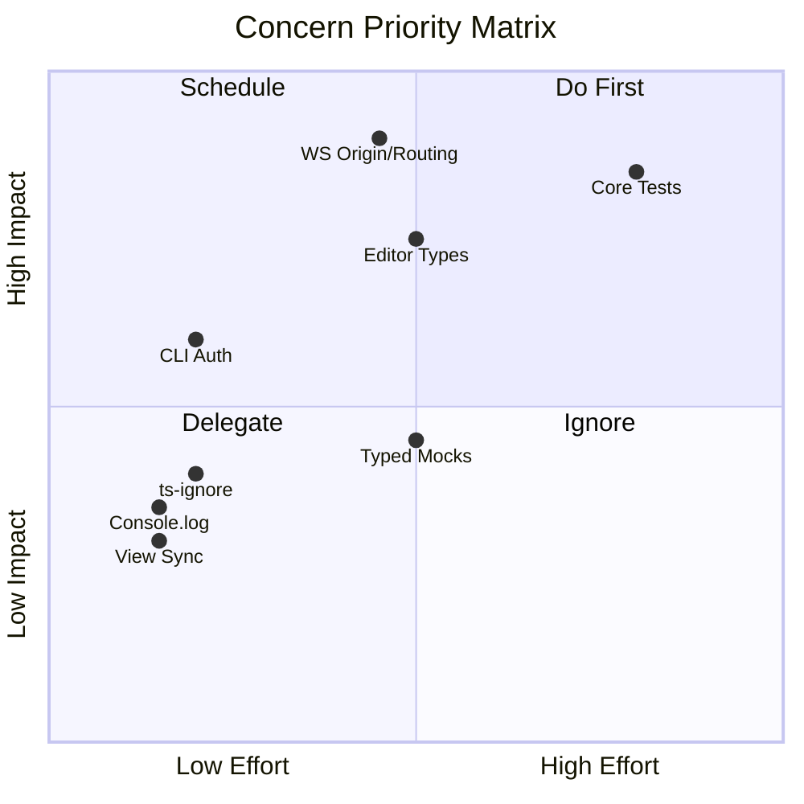

# CONCERNS.md — Codebase Risk & Concern Assessment

> Generated: 2026-04-13 | Focus: concerns

## Summary

Multica is a well-structured monorepo with clear architectural boundaries. The main concerns center on **low test coverage in shared packages**, **type safety gaps in editor extensions**, and **incomplete WebSocket message routing**. No critical security vulnerabilities were found, but several medium-severity items warrant attention.

---

## 1. Testing Gaps

### Severity: High

**Evidence:**
- Shared packages: **8 test files** for **265 source files** (~3% coverage)
- `packages/core/`: Most stores, API client logic, and platform utilities lack unit tests
- `packages/views/`: Only `issues-page.test.tsx` and `issue-detail.test.tsx` exist
- `apps/web/`: Only 1 test file
- E2E: Only 5 spec files

```
Source Files vs Tests (packages/):
├── Source files (*.ts, *.tsx, excl. tests/d.ts): 265
├── Test files (*.test.ts, *.test.tsx):             8
└── Coverage ratio:                                 ~3%
```

**Impact:** Refactoring shared packages is risky — no safety net to catch regressions.

**Suggestion:** Prioritize tests for `packages/core/` stores (auth, workspace, issues) and `packages/core/api/` client logic. These are the most imported modules and the most critical paths.

---

## 2. Type Safety in Editor Extensions

### Severity: High

**Evidence:** `packages/views/editor/extensions/` has extensive use of `any`:

- `file-upload.ts`: 7 instances of `any` — `editor: any`, `node: any`, `helpers: any`
- `file-card.tsx`: `renderMarkdown: (node: any) => ...`
- `mention-extension.ts`: `parseMarkdown: (token: any, helpers: any) => ...`

**Impact:** Editor extensions are a core feature. `any` types bypass TypeScript's safety net, making refactoring dangerous and runtime errors likely in edge cases.

**Suggestion:** Define proper TipTap node types for the editor extensions. Use generic type parameters from `@tiptap/core` instead of `any`.

---

## 3. Incomplete WebSocket Message Routing

### Severity: High

**Evidence:**
- `server/internal/realtime/hub.go:28` — `// TODO: Restrict origins in production`
- `server/internal/realtime/hub.go:313` — `// TODO: Route inbound messages to appropriate handlers`
- `packages/core/api/ws-client.ts` — 5 TODO/FIXME items

**Impact:**
- Unrestricted WebSocket origins = potential CSRF over WebSocket in production
- Inbound message routing is a no-op — agents cannot send messages back through WS yet
- Client-side WS handling has multiple unresolved edge cases

**Suggestion:** Complete the WS message routing before enabling agent-to-agent communication. Restrict origins via environment configuration.

---

## 4. Test Mock Quality — Excessive `any` in Mocks

### Severity: Medium

**Evidence:** Test files in `packages/views/` use `any` heavily for mock components:

```typescript
// issues-page.test.tsx — 20 instances of any
AppLink: ({ children, href, ...props }: any) => ...
DndContext: ({ children }: any) => children
```

**Impact:** Mocks with `any` don't validate prop types — a component's API could change and the test would still pass silently.

**Suggestion:** Define typed mock interfaces that match component props. This also serves as living documentation of component APIs.

---

## 5. Console Logging Left in Production Code

### Severity: Medium

**Evidence:**
- `packages/views/issues/components/agent-live-card.tsx`: 8 console calls
- `packages/ui/markdown/CodeBlock.tsx`: 2 console calls
- `apps/web/components/theme-provider.tsx`: 2 console calls

**Impact:** Console output in production reveals internal state to browser devtools. Not a security issue per se, but unprofessional and potentially verbose.

**Suggestion:** Replace with a proper logger that can be silenced in production, or remove outright.

---

## 6. TypeScript Suppress Directives

### Severity: Medium

**Evidence:**
- `packages/core/platform/core-provider.tsx`: `@ts-ignore` or `eslint-disable`
- `packages/views/editor/readonly-content.tsx`: suppressed type check
- `packages/views/chat/components/chat-window.tsx`: suppressed type check
- `packages/views/editor/extensions/code-block-view.tsx`: suppressed type check

**Impact:** Each suppression hides a potential type error. Accumulated suppressions erode the value of strict mode.

**Suggestion:** Resolve the underlying type issues rather than suppressing. Track suppressions as tech-debt items.

---

## 7. Go Backend Test Distribution

### Severity: Medium

**Evidence:**
- 31 Go test files exist — good coverage
- But `panic()` / `log.Fatal` only found in test files (bus_test.go), indicating clean production code
- CLI client missing auth header support: `server/internal/cli/client.go:19` — `// TODO: Add Authorization header support`

**Impact:** CLI cannot authenticate with agent routes. This blocks CLI-based agent workflows.

**Suggestion:** Implement auth header support in the CLI client as a prerequisite for agent CLI features.

---

## 8. Package Boundary Compliance

### Severity: Low

**Evidence:**
- `packages/ui/` — zero `@multica/core` imports ✅ (boundary respected)
- `packages/views/` — 20+ files importing from `@multica/core` ✅ (expected dependency direction)
- `packages/core/` — uses `StorageAdapter` pattern instead of raw `localStorage` ✅
- No `next/*` or `react-router-dom` imports found in shared packages ✅

**Assessment:** Package boundaries are well-enforced. This is a strength of the codebase.

---

## 9. State Management Hygiene

### Severity: Low

**Evidence:**
- View store has a notable TODO: `packages/core/issues/stores/view-store.ts:230` — `// TODO: If no subscribeToWorkspace is provided, the workspace sync is a no-op.`
- This means workspace view synchronization silently fails without the subscription function

**Impact:** Subtle bugs where workspace views don't sync across tabs/devices when the subscription path is missing.

**Suggestion:** Either make the subscription required (breaking change) or log a warning when it's absent.

---

## 10. Architecture Strengths

The following areas are notably well-done:

- **Monorepo structure** — clear separation of apps vs packages, internal packages pattern
- **Platform bridge** — `CoreProvider` + `NavigationAdapter` cleanly abstracts platform differences
- **State management** — TanStack Query for server state, Zustand for client state, no duplication
- **Package boundaries** — hard constraints enforced, no violations detected
- **Go backend** — sqlc for type-safe queries, Chi router, clean handler pattern
- **Multi-tenancy** — workspace-scoped queries with `X-Workspace-ID` header routing

---

## Priority Matrix

| Priority | Concern | Effort |
|----------|---------|--------|
| P0 | WebSocket origin restriction + message routing | Medium |
| P1 | Test coverage for `packages/core/` | High |
| P1 | Editor extension type safety (remove `any`) | Medium |
| P2 | CLI auth header support | Low |
| P2 | Remove console.log from production code | Low |
| P3 | Typed test mocks | Medium |
| P3 | Resolve ts-ignore directives | Low |
| P3 | View store sync warning | Low |

---


