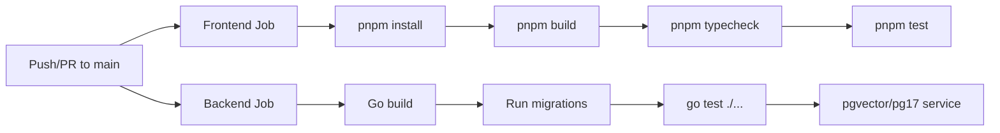

# Testing Patterns

**Analysis Date:** 2026-04-13

## Test Framework

**Runner:**
- Vitest 4.1 (TypeScript tests) -- configured via pnpm catalog for unified versioning
- Go standard `go test` (backend tests)
- Playwright 1.58 (E2E tests)

**Assertion Library:**
- Vitest built-in (`expect`, `vi.fn()`, `vi.mock()`)
- `@testing-library/jest-dom` for DOM assertions (`toBeInTheDocument`, `toBeDisabled`, etc.)
- `@testing-library/react` for component queries (`screen.getByText`, `screen.getByLabelText`, etc.)
- `@testing-library/user-event` for user interaction simulation

**Run Commands:**
```bash
pnpm test                                    # All TS tests (Vitest via Turborepo)
pnpm --filter @multica/views exec vitest run # Single package
pnpm --filter @multica/core exec vitest run  # Core package only
pnpm --filter @multica/web exec vitest run   # Web app tests only
cd server && go test ./...                   # All Go tests
cd server && go test ./internal/handler/ -run TestName  # Single Go test
pnpm exec playwright test                    # E2E tests (requires running backend + frontend)
make test                                    # Go tests with DB setup
make check                                   # Full verification: typecheck + TS tests + Go tests + E2E
```

## Test File Organization

**Location: Co-located with source files**

Tests live next to the code they test:

```
packages/core/
  platform/
    persist-storage.ts
    persist-storage.test.ts        # <-- colocated
    workspace-storage.ts
    workspace-storage.test.ts      # <-- colocated
    storage-cleanup.ts
    storage-cleanup.test.ts        # <-- colocated

packages/views/
  auth/
    login-page.tsx
    login-page.test.tsx            # <-- colocated
  issues/components/
    issues-page.tsx
    issues-page.test.tsx           # <-- colocated
    issue-detail.tsx
    issue-detail.test.tsx          # <-- colocated

server/internal/handler/
  handler.go
  handler_test.go                  # <-- colocated (Go convention)
  issue.go
  search_test.go                   # <-- colocated
  activity.go
  activity_test.go                 # <-- colocated

e2e/
  auth.spec.ts                     # <-- separate E2E directory
  issues.spec.ts
  comments.spec.ts
  helpers.ts
  fixtures.ts
```

**Naming Convention:**
- TypeScript: `<filename>.test.ts` or `<filename>.test.tsx`
- Go: `<filename>_test.go`
- E2E: `<feature>.spec.ts`

## Test Configuration by Package

**`packages/core/` -- Vitest, Node environment:**
```typescript
// packages/core/vitest.config.ts
import { defineConfig } from "vitest/config";
export default defineConfig({
  test: {
    globals: true,
    include: ["**/*.test.{ts,tsx}"],
    passWithNoTests: true,
  },
});
```
- No DOM -- pure logic tests
- No jsdom needed -- tests stores, utilities, storage abstractions

**`packages/views/` -- Vitest, jsdom environment:**
```typescript
// packages/views/vitest.config.ts
import { defineConfig } from "vitest/config";
import react from "@vitejs/plugin-react";
export default defineConfig({
  plugins: [react()],
  test: {
    environment: "jsdom",
    globals: true,
    setupFiles: ["./test/setup.ts"],
    include: ["**/*.test.{ts,tsx}"],
  },
});
```

**`apps/web/` -- Vitest, jsdom with path aliases:**
```typescript
// apps/web/vitest.config.ts
import { defineConfig } from "vitest/config";
import react from "@vitejs/plugin-react";
import path from "path";
export default defineConfig({
  plugins: [react()],
  test: {
    environment: "jsdom",
    globals: true,
    setupFiles: ["./test/setup.ts"],
    include: ["**/*.test.{ts,tsx}"],
  },
  resolve: {
    alias: {
      "@": path.resolve(__dirname, "."),
      "@core": path.resolve(__dirname, "core"),
    },
  },
});
```

**E2E -- Playwright, Chromium only:**
```typescript
// playwright.config.ts
import { defineConfig } from "@playwright/test";
export default defineConfig({
  testDir: "./e2e",
  timeout: 30000,
  retries: 0,
  use: {
    baseURL: process.env.PLAYWRIGHT_BASE_URL ?? process.env.FRONTEND_ORIGIN ?? "http://localhost:3000",
    headless: true,
  },
  projects: [{ name: "chromium", use: { browserName: "chromium" } }],
});
```
- No auto-start of servers -- backend and frontend must be running already

## Test Setup Files

**`packages/views/test/setup.ts`:**
```typescript
import "@testing-library/jest-dom/vitest";

// jsdom doesn't provide ResizeObserver
if (typeof globalThis.ResizeObserver === "undefined") {
  globalThis.ResizeObserver = class ResizeObserver {
    observe() {}
    unobserve() {}
    disconnect() {}
  } as unknown as typeof ResizeObserver;
}

// jsdom doesn't implement elementFromPoint
if (typeof document.elementFromPoint !== "function") {
  document.elementFromPoint = () => null;
}
```

**`apps/web/test/setup.ts`:**
Same as views setup, plus localStorage mock for jsdom 29/Node 22+:
```typescript
import "@testing-library/jest-dom/vitest";
import { vi } from "vitest";
// ... ResizeObserver stub ...
// localStorage mock if missing
if (typeof globalThis.localStorage === "undefined" || /* ... */) {
  const store: Record<string, string> = {};
  const localStorageMock = {
    getItem: vi.fn((key: string) => store[key] ?? null),
    setItem: vi.fn((key: string, value: string) => { store[key] = value; }),
    // ...
  };
  Object.defineProperty(globalThis, "localStorage", { value: localStorageMock, writable: true });
}
```

## Test Structure Patterns

### Core/Unit Tests (Node, no DOM)

**Pattern: Simple describe/it with mock adapter:**
```typescript
// packages/core/platform/persist-storage.test.ts
import { describe, it, expect, vi } from "vitest";
import { createPersistStorage } from "./persist-storage";
import type { StorageAdapter } from "../types/storage";

function mockAdapter(): StorageAdapter {
  const store = new Map<string, string>();
  return {
    getItem: vi.fn((k) => store.get(k) ?? null),
    setItem: vi.fn((k, v) => store.set(k, v)),
    removeItem: vi.fn((k) => store.delete(k)),
  };
}

describe("createPersistStorage", () => {
  it("delegates to StorageAdapter", () => {
    const adapter = mockAdapter();
    const storage = createPersistStorage(adapter);
    storage.setItem("key", JSON.stringify("value"));
    expect(adapter.setItem).toHaveBeenCalledWith("key", JSON.stringify("value"));
  });
});
```

### View/Component Tests (jsdom, React)

**Pattern: Hoisted mocks + render + assertions:**
```typescript
// 1. Hoisted mocks (declared before vi.mock)
const mockSendCode = vi.hoisted(() => vi.fn());
const mockVerifyCode = vi.hoisted(() => vi.fn());

// 2. Mock modules
vi.mock("@multica/core/auth", () => ({
  useAuthStore: Object.assign(
    (selector?: (s: unknown) => unknown) => {
      const state = { sendCode: mockSendCode, verifyCode: mockVerifyCode };
      return selector ? selector(state) : state;
    },
    { getState: () => ({ sendCode: mockSendCode, verifyCode: mockVerifyCode }) },
  ),
}));

// 3. Import component AFTER mocks
import { LoginPage } from "./login-page";

// 4. Test
describe("LoginPage", () => {
  beforeEach(() => { vi.clearAllMocks(); });
  it("renders email form", () => {
    render(<LoginPage onSuccess={vi.fn()} />);
    expect(screen.getByText(/sign in to multica/i)).toBeInTheDocument();
  });
});
```

### App-Level Tests (jsdom, framework mocks)

**Pattern: Mock framework-specific APIs:**
```typescript
// apps/web/app/(auth)/login/page.test.tsx
// Mock next/navigation (only in app-level tests!)
vi.mock("next/navigation", () => ({
  useRouter: () => ({ push: vi.fn(), replace: vi.fn() }),
  usePathname: () => "/login",
  useSearchParams: () => new URLSearchParams(),
}));
// Then test the page wrapper
```

## Mocking Conventions

### Zustand Store Mocking

Zustand stores are both callable hooks AND have `.getState()`. Mock them with `Object.assign`:

```typescript
vi.mock("@multica/core/auth", () => ({
  useAuthStore: Object.assign(
    // Hook form -- component may call useAuthStore(selector)
    (selector?: (s: unknown) => unknown) => {
      const state = { sendCode: mockSendCode, user: null };
      return selector ? selector(state) : state;
    },
    {
      // .getState() form -- used by non-React code
      getState: () => ({ sendCode: mockSendCode, user: null }),
    },
  ),
}));
```

**Why `Object.assign`:** Zustand stores are callable (used as hooks) AND have a `.getState()` method. The mock must satisfy both patterns.

### API Mocking

Use `vi.hoisted()` for API mocks that need to be referenced in both mock definitions and test bodies:

```typescript
const mockListIssues = vi.hoisted(() => vi.fn().mockResolvedValue({ issues: [], total: 0 }));
vi.mock("@multica/core/api", () => ({
  api: { listIssues: (...args: any[]) => mockListIssues(...args) },
  getApi: () => ({ listIssues: (...args: any[]) => mockListIssues(...args) }),
  setApiInstance: vi.fn(),
}));
```

### Navigation Mocking (Views Package)

In `packages/views/` tests, mock the local navigation module (never `next/navigation` or `react-router-dom`):

```typescript
vi.mock("../../navigation", () => ({
  AppLink: ({ children, href, ...props }: any) => <a href={href} {...props}>{children}</a>,
  useNavigation: () => ({ push: vi.fn(), pathname: "/issues" }),
  NavigationProvider: ({ children }: { children: React.ReactNode }) => children,
}));
```

### Complex Third-Party Mocking

Mock heavy libraries (dnd-kit, base-ui accordion, Tiptap editor) with lightweight stubs:

```typescript
vi.mock("@dnd-kit/core", () => ({
  DndContext: ({ children }: any) => children,
  DragOverlay: () => null,
  PointerSensor: class {},
  useSensor: () => ({}),
  useSensors: () => [],
}));
```

### Editor Mocking (Tiptap)

The Tiptap rich-text editor requires real DOM. Mock with a simple textarea:

```typescript
vi.mock("../../editor", () => ({
  ContentEditor: forwardRef(({ defaultValue, onUpdate, placeholder }: any, ref: any) => {
    const valueRef = useRef(defaultValue || "");
    const [value, setValue] = useState(defaultValue || "");
    useImperativeHandle(ref, () => ({
      getMarkdown: () => valueRef.current,
      clearContent: () => { valueRef.current = ""; setValue(""); },
    }));
    return <textarea value={value} onChange={(e) => { valueRef.current = e.target.value; setValue(e.target.value); onUpdate?.(e.target.value); }} data-testid="rich-text-editor" />;
  }),
}));
```

### Config Mocking

Issue status/priority config must be mocked in component tests:

```typescript
vi.mock("@multica/core/issues/config", () => ({
  ALL_STATUSES: ["backlog", "todo", "in_progress", "in_review", "done", "blocked", "cancelled"],
  STATUS_ORDER: ["backlog", "todo", "in_progress", "in_review", "done", "blocked", "cancelled"],
  STATUS_CONFIG: { backlog: { label: "Backlog", iconColor: "text-muted-foreground" }, /* ... */ },
}));
```

### View Store Context Mocking

For components using the view store via context:

```typescript
vi.mock("@multica/core/issues/stores/view-store-context", () => ({
  ViewStoreProvider: ({ children }: { children: React.ReactNode }) => children,
  useViewStore: (selector?: any) => (selector ? selector(mockViewState) : mockViewState),
  useViewStoreApi: () => ({ getState: () => mockViewState, setState: vi.fn(), subscribe: vi.fn() }),
}));
```

## QueryClient Helper

Components using TanStack Query need a test QueryClient:

```typescript
function renderWithQuery(ui: React.ReactElement) {
  const qc = new QueryClient({
    defaultOptions: {
      queries: { retry: false, gcTime: 0 },
      mutations: { retry: false },
    },
  });
  return render(
    <QueryClientProvider client={qc}>
      <WorkspaceIdProvider wsId="ws-1">{ui}</WorkspaceIdProvider>
    </QueryClientProvider>,
  );
}
```

Key settings: `retry: false` (no retries in tests), `gcTime: 0` (immediate garbage collection).

## E2E Testing

### Test API Client (`e2e/fixtures.ts`)

`TestApiClient` provides API-level data setup/teardown using raw `fetch`:
- Authenticates via: send-code -> read code from database -> verify-code -> get JWT
- Creates workspace, issues via API
- Tracks created issue IDs for cleanup
- Uses `pg` (PostgreSQL driver) to read verification codes directly from DB

```typescript
import { TestApiClient } from "./fixtures";

let api: TestApiClient;

test.beforeEach(async ({ page }) => {
  api = await createTestApi();   // Login + ensure workspace
  await loginAsDefault(page);     // Inject token into browser
});

test.afterEach(async () => {
  await api.cleanup();            // Delete all test issues
});
```

### E2E Test Helpers (`e2e/helpers.ts`)

- `loginAsDefault(page)`: Authenticates via API, injects JWT into `localStorage`, navigates to `/issues`
- `createTestApi()`: Creates a `TestApiClient` logged in as `e2e@multica.ai`
- `openWorkspaceMenu(page)`: Clicks workspace switcher dropdown

### E2E Test Data

Default E2E credentials:
- Email: `e2e@multica.ai`
- Name: `E2E User`
- Workspace slug: `e2e-workspace`

### E2E Pattern: API Setup + Browser Verification

```typescript
test("can navigate to issue detail page", async ({ page }) => {
  // Create fixture via API
  const issue = await api.createIssue("E2E Detail Test " + Date.now());

  // Verify in browser
  await page.reload();
  await expect(page.locator("text=All Issues")).toBeVisible();
  const issueLink = page.locator(`a[href="/issues/${issue.id}"]`);
  await expect(issueLink).toBeVisible({ timeout: 5000 });
  await issueLink.click();
  await page.waitForURL(/\/issues\/[\w-]+/);
  await expect(page.locator("text=Properties")).toBeVisible();
});
```

## Go Backend Tests

**Structure:**
- Colocated `_test.go` files using same package name (`package handler`)
- `TestMain` sets up shared fixtures (database connection, test user, test workspace)
- Direct database queries for fixture setup/cleanup

**Fixture Pattern:**
```go
func TestMain(m *testing.M) {
    ctx := context.Background()
    dbURL := os.Getenv("DATABASE_URL")
    pool, err := pgxpool.New(ctx, dbURL)
    // ... setup handler with real DB
    testHandler = New(queries, pool, hub, bus, emailSvc, nil, nil)
    testUserID, testWorkspaceID, _ = setupHandlerTestFixture(ctx, pool)
    code := m.Run()
    cleanupHandlerTestFixture(context.Background(), pool)
    os.Exit(code)
}
```

**Request Helper:**
```go
func newRequest(method, path string, body any) *http.Request {
    var buf bytes.Buffer
    if body != nil { json.NewEncoder(&buf).Encode(body) }
    req := httptest.NewRequest(method, path, &buf)
    req.Header.Set("Content-Type", "application/json")
    req.Header.Set("X-User-ID", testUserID)
    req.Header.Set("X-Workspace-ID", testWorkspaceID)
    return req
}
```

**Database Cleanup:**
Fixtures are cleaned up by deleting test workspace and user:
```go
func cleanupHandlerTestFixture(ctx context.Context, pool *pgxpool.Pool) error {
    pool.Exec(ctx, `DELETE FROM workspace WHERE slug = $1`, handlerTestWorkspaceSlug)
    pool.Exec(ctx, `DELETE FROM "user" WHERE email = $1`, handlerTestEmail)
    return nil
}
```

**Go Test Types:**
- Pure unit tests (no DB): `search_test.go` tests query-building logic
- Integration tests (with DB): `handler_test.go`, `activity_test.go`, `subscriber_test.go`

## CI Test Pipeline

**GitHub Actions (`ci.yml`):**



- Two parallel jobs: `frontend` and `backend`
- Frontend: Node 22, pnpm install -> build -> typecheck -> test
- Backend: Go 1.26.1, PostgreSQL pgvector:pg17 service, migrate -> go test
- No E2E in CI (E2E requires running servers, run manually with `make check`)

## Coverage

**Requirements:** None enforced (no coverage thresholds configured)

**Test Count by Area:**

| Area | Files | Description |
|------|-------|-------------|
| `packages/core/platform/` | 3 test files | Storage abstractions, workspace-scoped storage |
| `packages/views/auth/` | 1 test file | LoginPage component (662 lines, very thorough) |
| `packages/views/issues/components/` | 2 test files | IssuesPage and IssueDetail components |
| `apps/web/` | 1 test file | Next.js-specific login page wrapper |
| `e2e/` | 5 spec files | Auth, issues, comments, navigation, settings |
| `server/internal/handler/` | 5 test files | API handler integration tests |

## Test Decision Guide

| What you're testing | Where the test lives | Environment |
|---|---|---|
| Pure logic (stores, utilities, storage) | `packages/core/*.test.ts` | Node (no DOM) |
| Shared React components | `packages/views/*.test.tsx` | jsdom |
| Platform wiring (Next.js/Electron) | `apps/web/*.test.tsx` or `apps/desktop/` | jsdom with framework mocks |
| Full user flows | `e2e/*.spec.ts` | Real browser + real backend |
| Go HTTP handlers | `server/internal/handler/*_test.go` | Real PostgreSQL |

**Key rule:** Never test shared component behavior in an app's test file. If a test requires mocking `next/navigation` or `react-router-dom` to test a `@multica/views` component, the test is in the wrong place.

## Common Test Utilities

**Async Assertions:**
```typescript
// Wait for element to appear after async operation
await waitFor(() => {
  expect(screen.getByText("Check your email")).toBeInTheDocument();
});

// Find element (auto-waits)
await screen.findByText("Implement auth");
```

**User Interaction:**
```typescript
const user = userEvent.setup();
await user.type(screen.getByLabelText(/email/i), "test@example.com");
await user.click(screen.getByRole("button", { name: /continue/i }));
```

**Loading State Testing:**
```typescript
// Make API hang to keep loading state
mockSendCode.mockReturnValueOnce(new Promise(() => {}));
render(<LoginPage onSuccess={onSuccess} />);
expect(screen.getByText(/sending code/i)).toBeInTheDocument();
```

**Timer Testing:**
```typescript
beforeEach(() => { vi.useFakeTimers({ shouldAdvanceTime: true }); });
afterEach(() => { vi.useRealTimers(); });

// Advance timers for cooldown tests
for (let i = 0; i < 11; i++) {
  await act(async () => { vi.advanceTimersByTime(1_000); });
}
```

---

*Testing analysis: 2026-04-13*
