# Multica: AI-Native Task Management 的架构深度解析

> 本文从三个维度剖析 Multica 项目的多 Agent 编排架构：通用架构概念映射、Agent 为主角的设计哲学、以及 Task 全生命周期管理。

---

## 第一部分：架构概念解码 —— RAG、Agent Loop、Skills、MCP

### 1.1 RAG：Agentic Retrieval，而非管道检索

传统 RAG 系统的核心范式是：用户提问 → 向量检索 → 拼接上下文 → LLM 生成。Multica 完全没有采用这套范式。数据库层面没有 pgvector，没有 embedding 列，没有相似度搜索。项目的搜索能力基于 `pg_bigm` 的 bigram 全文索引（`server/migrations/032_issue_search_index.up.sql`），走的是传统 SQL `LIKE` 匹配路线。

但这不意味着 Multica 没有"检索增强生成"。它的 RAG 实现了一种更高级的模式：**Agentic RAG** —— 检索的发起者不是预定义的管道，而是 Agent 自身。

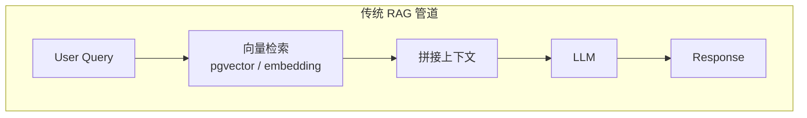

> 上图展示传统 RAG 的线性管道模式：检索-拼接-生成三步串行，用户无法干预中间过程。

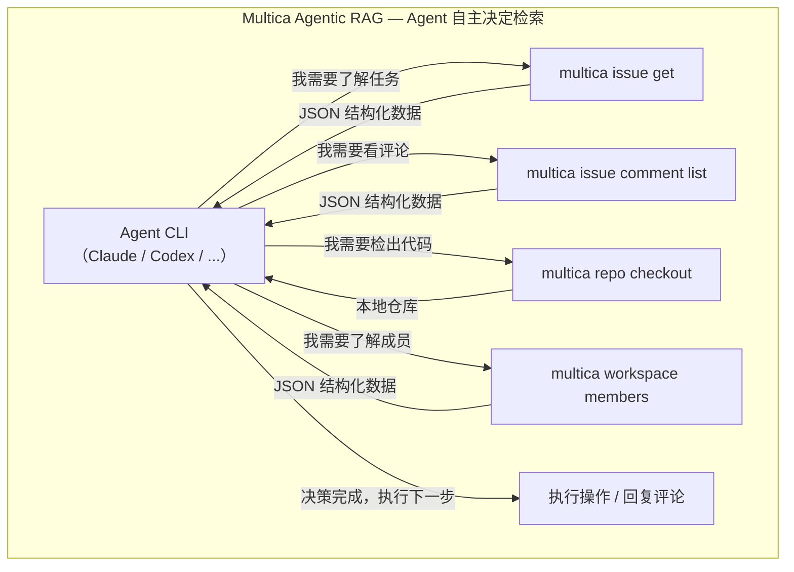

> 上图展示 Multica 的 Agentic RAG 模式：Agent 根据任务需要，自主发起 CLI 调用获取结构化数据。检索深度由 Agent 动态决定——简单任务只需读 issue，复杂任务则要 checkout 仓库、阅读代码。

**系统装配链路**是这样的：

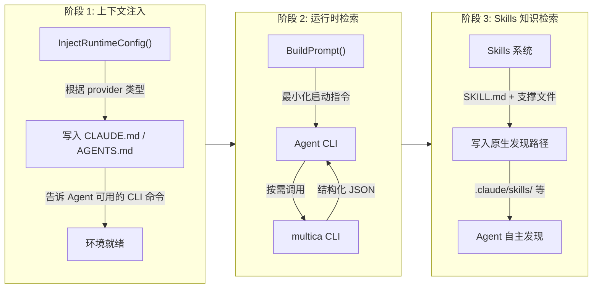

> 上图展示系统装配的三个阶段：**上下文注入**（`InjectRuntimeConfig()` 写入 CLAUDE.md 告知可用命令）→ **运行时检索**（`BuildPrompt()` 只给最小指令，Agent 自主决定调用哪些 CLI）→ **Skills 知识检索**（结构化指令通过原生发现机制加载）。三个阶段由不同函数负责，职责分离清晰。

1. **上下文注入阶段**（`server/internal/daemon/execenv/runtime_config.go:17`）：`InjectRuntimeConfig()` 函数根据 provider 类型（claude/codex/opencode 等）在工作目录写入 `CLAUDE.md` 或 `AGENTS.md`。这个文件告诉 Agent："你可以用 `multica issue get <id> --output json` 获取 issue 详情，用 `multica issue comment list` 获取评论，用 `multica workspace members` 查看成员列表。"

2. **运行时检索阶段**：Agent 在执行过程中，按需调用 `multica` CLI 命令获取结构化 JSON 数据。`BuildPrompt()`（`server/internal/daemon/prompt.go:11`）只给出最小化的启动指令 —— "先运行 `multica issue get {id}` 了解你的任务"，具体的上下文获取完全由 Agent 自主决策。

3. **Skills 作为结构化知识检索**：Skills 系统（`server/migrations/008_structured_skills.up.sql`）提供了另一种检索维度。每个 Skill 是一组结构化指令（`SKILL.md` + 支撑文件），在任务执行时通过 `LoadAgentSkills()` 加载并写入 Agent 的原生发现路径（如 Claude 的 `.claude/skills/`，Codex 的 `CODEX_HOME/skills/`）。

这种设计的哲学是：**让 Agent 自己决定需要什么信息，而不是替它决定**。这比传统 RAG 更灵活，因为 Agent 可以根据任务复杂度动态决定检索深度 —— 简单的评论回复只需读 issue 和评论，复杂的代码实现则要 checkout 仓库、阅读代码、理解上下文。

### 1.2 Agent Loop：信号量约束的并发执行引擎

Multica 的 Agent Loop 不是单 Agent 的 Think-Act-Observe 循环，而是一个**分布式任务调度系统**，核心在 Daemon 的 `pollLoop()`（`server/internal/daemon/daemon.go:684`）。

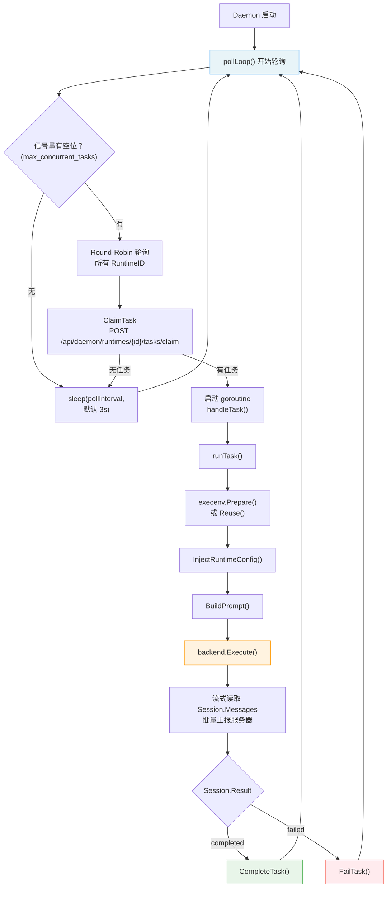

> 上图展示 Agent Loop 的双层循环结构。**外层** `pollLoop()` 使用信号量控制最大并发（默认 20），以 round-robin 方式轮询所有已注册 Runtime，通过 `ClaimTask` 获取任务后启动独立 goroutine。**内层** `handleTask()` → `runTask()` 完成环境准备、配置注入、Agent 启动和消息流式转发。关键洞察：**Agent Loop 的 "Loop" 不在 Multica 内部，而在 Agent CLI 内部**——Multica 管调度，Agent CLI 管推理。

**Backend 接口**（`server/pkg/agent/agent.go:14`）是整个执行循环的抽象核心：

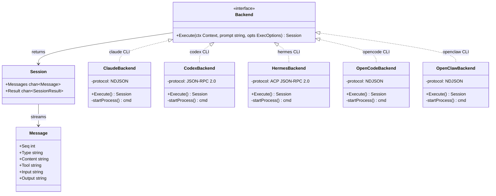

> 上图展示 Backend 接口的类层次结构。`Backend` 接口只暴露一个 `Execute()` 方法，5 种后端实现分别对应不同 Agent CLI，通信协议各异（NDJSON、JSON-RPC 2.0、ACP）。但 Multica 层面统一呈现为 `Session{Messages, Result}` 模型——消息类型标准化为 `text`、`thinking`、`tool-use`、`tool-result`、`error` 等。这种抽象使得新增 Agent 后端只需实现一个 `Backend` 即可。

| Backend | 通信协议 | 启动方式 |
|---------|---------|---------|
| Claude | NDJSON (stream-json) | `claude -p --output-format stream-json` |
| Codex | JSON-RPC 2.0 (stdio) | `codex app-server --listen stdio://` |
| Hermes | ACP JSON-RPC 2.0 (stdio) | `hermes acp` |
| OpenCode | NDJSON | `opencode run --format json` |
| OpenClaw | NDJSON | `openclaw agent --output-format stream-json` |

每种后端都是把 Agent CLI 作为子进程启动，通过 stdin/stdout 流式通信。`Session` 提供两个 channel：`Messages`（流式事件）和 `Result`（最终结果）。这种设计的关键洞察是：**Agent Loop 的 "Loop" 不在 Multica 内部，而在 Agent CLI 内部**。Multica 管的是任务调度的循环，Agent CLI 管的是 Think-Act-Observe 的推理循环。

**容错与清理**：

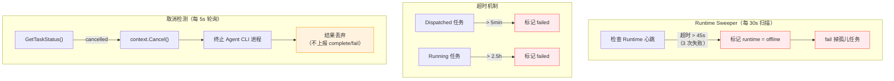

> 上图展示三重容错机制：**Runtime Sweeper**（`server/cmd/server/runtime_sweeper.go`，每 30s）检测心跳超时并清理孤儿任务；**超时机制**对 dispatched（5min）和 running（2.5h）状态的任务自动标记失败；**取消检测**（每 5s）在用户取消时通过 Go context 终止 Agent CLI 进程。

### 1.3 Skills：Agent 的可插拔知识模块

Skills 系统是 Multica 最重要的上下文工程工具之一。

**数据模型**（`server/migrations/008_structured_skills.up.sql`）：

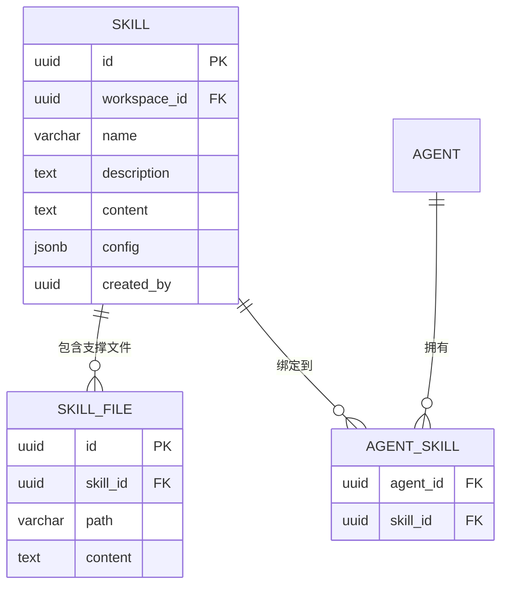

> 上图展示 Skills 数据模型的 ER 关系。`skill` 存储核心指令（content），`skill_file` 存储支撑文件（多对一），`agent_skill` 实现 Agent 与 Skill 的多对多绑定。所有 Skill 作用域限制在 `workspace_id` 内。

**生命周期**：

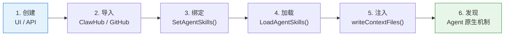

> 上图展示 Skill 的完整生命周期：从创建/导入 → 绑定到 Agent → 任务 Claim 时加载 → 写入 Provider 原生发现路径 → Agent CLI 通过自身机制自动发现。关键设计：**Multica 不实现自己的 Skill 加载器**，只负责把文件放到正确位置，由各 Agent CLI 的原生发现机制完成加载。

1. **创建**：通过 UI 或 API 创建 Skill，包含核心指令（content）和可选的支撑文件（skill_file）
2. **导入**：`ImportSkill` 支持从外部源导入（ClawHub、GitHub 仓库的 skills.sh）
3. **绑定**：通过 `SetAgentSkills` 将 Skill 关联到特定 Agent
4. **加载**：任务被 Claim 时，`LoadAgentSkills()`（`server/internal/service/task.go:400`）查询 Agent 的所有 Skills 及其文件
5. **注入**：`writeContextFiles()`（`server/internal/daemon/execenv/context.go`）将 Skills 写入 Agent 工作目录的原生发现路径

**注入路径的 Provider 适配**：

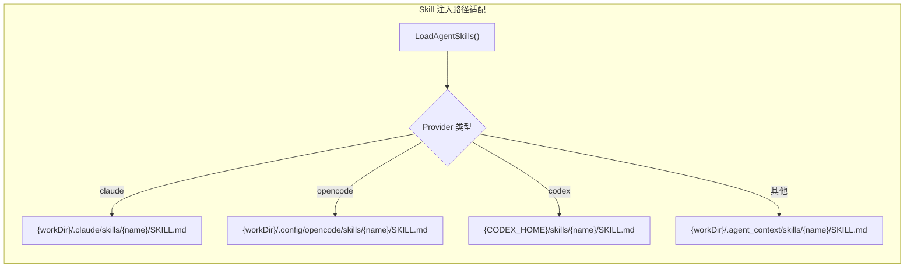

> 上图展示 Skill 注入时的 Provider 路径适配。不同 Agent CLI 扫描不同的目录来发现 Skills——Claude Code 扫描 `.claude/skills/`，Codex 扫描 `CODEX_HOME/skills/`，OpenCode 扫描 `.config/opencode/skills/`。Multica 只负责把文件写到正确位置，利用 Agent CLI 的原生发现机制完成加载。

**Meta Skill**：除了用户定义的 Skills，`buildMetaSkillContent()` 函数会生成一个"元技能"文件（CLAUDE.md 或 AGENTS.md）。这个文件不是传统意义上的 Skill，而是**运行时环境的完整说明书**，包含：Agent 身份指令、可用命令、工作流步骤、仓库列表、Mention 格式、附件处理、输出准则。

### 1.4 MCP：委托而非实现

MCP（Model Context Protocol）在 Multica 中的角色很特殊：Multica **没有实现 MCP Server**。

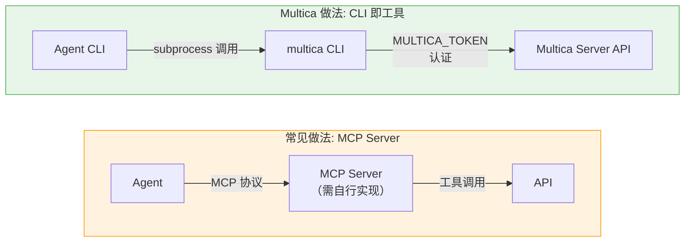

> 上图对比两种工具提供方式：常见做法是实现 MCP Server（但 MCP 是 Anthropic 协议，Codex/OpenCode 等不一定支持）；Multica 选择 **CLI 即工具**——Agent 通过子进程调用 `multica` CLI，CLI 通过 `MULTICA_TOKEN` 环境变量认证。这种做法对所有 Agent 后端通用，且每次调用都有日志，可审计性更好。

- Claude 后端传 `--strict-mcp-config` 标志（`server/pkg/agent/claude.go:340`）
- Hermes 后端在 session/new 时传 `"mcpServers": []any{}`（`server/pkg/agent/hermes.go:163`）

这说明 Multica 的设计选择是：**Agent 的工具调用能力通过 CLI 命令而非 MCP 协议提供**。`multica` CLI 就是 Agent 的"工具集"：

```bash
multica issue get <id>         # 读取 issue
multica issue status <id> X    # 更新状态
multica issue comment add ...  # 发表评论
multica repo checkout <url>    # 检出仓库
multica workspace members      # 查看成员
```

这种设计的优势是：
1. **不依赖特定协议**：MCP 是 Anthropic 的协议，Codex、OpenCode 等不一定支持。CLI 命令对所有 Agent 通用
2. **可审计性**：每次 CLI 调用都有日志，比 MCP 的实时通信更容易追踪
3. **安全性**：通过 `MULTICA_TOKEN` 环境变量认证，每个任务有独立的 token，权限边界清晰

---

## 第二部分：以 Agent 为主角 —— Teammates、Runtimes、Workspace

### 2.1 Agents as Teammates：多态身份系统

Multica 最独特的设计之一是 Agent 不只是工具，而是**团队中的平等成员**。这体现在数据模型的每一个角落。

**多态 Assignee 设计**：

```mermaid
classDiagram
    class Issue {
        +uuid id
        +uuid workspace_id
        +string title
        +string assignee_type
        +uuid assignee_id
        +string creator_type
        +uuid creator_id
    }

    class Comment {
        +uuid id
        +uuid workspace_id
        +string author_type
        +uuid author_id
    }

    class ActivityLog {
        +uuid id
        +string actor_type
        +uuid actor_id
    }

    class InboxItem {
        +uuid id
        +uuid workspace_id
        +string recipient_type
        +uuid recipient_id
    }

    class Member {
        +uuid user_id
        +string role
    }

    class Agent {
        +uuid id
        +string name
        +string instructions
        +string status
    }

    Issue -->|"assignee_type: member/agent"| Member : "assignee_id →"
    Issue -->|"creator_type: member/agent"| Member : "creator_id →"
    Issue -->|"assignee_type: member/agent"| Agent : "assignee_id →"
    Issue -->|"creator_type: member/agent"| Agent : "creator_id →"
    Comment -->|"author_type: member/agent"| Member : "author_id →"
    Comment -->|"author_type: member/agent"| Agent : "author_id →"
    ActivityLog -->|"actor_type: member/agent"| Member : "actor_id →"
    ActivityLog -->|"actor_type: member/agent"| Agent : "actor_id →"
    InboxItem -->|"recipient_type: member/agent"| Member : "recipient_id →"
    InboxItem -->|"recipient_type: member/agent"| Agent : "recipient_id →"
```

> 上图展示贯穿系统的多态身份模型。`Issue`、`Comment`、`ActivityLog`、`InboxItem` 四个核心实体都使用 `{role}_type` + `{role}_id` 的多态外键模式，`type` 为枚举（`member` / `agent`），`id` 指向对应表。这意味着 Agent 可以被分配 Issue、创建 Issue、发表评论、收到通知、产生活动日志——拥有与人类成员完全相同的身份能力。

```sql
-- issue 表
assignee_type ENUM('member', 'agent')
assignee_id   UUID  -- 指向 member.user_id 或 agent.id

-- 同样的模式贯穿整个系统:
comment.author_type / author_id
issue.creator_type / creator_id
activity_log.actor_type / actor_id
inbox_item.recipient_type / recipient_id
```

这意味着 Agent 可以：
- 被 **分配** Issue（作为 assignee）
- **创建** Issue（作为 creator）
- **发表** 评论（作为 author）
- **收到** 通知（作为 recipient）
- **产生** 活动日志（作为 actor）

**Agent Profile**（`server/migrations/001_init.up.sql` + 后续 migrations）：

| 属性 | 说明 |
|------|------|
| `name` | 显示名称 |
| `avatar_url` | 头像 |
| `description` | 简介 |
| `instructions` | 个性化系统指令（Agent 的"人格"） |
| `visibility` | workspace（全员可见）或 private（仅 owner/admin 可分配） |
| `status` | idle / working / blocked / error / offline |
| `runtime_mode` | local / cloud |
| `max_concurrent_tasks` | 最大并发任务数（默认 6） |
| `owner_id` | 归属者 |

**权限控制**（`server/internal/handler/agent.go` + `issue.go`）：

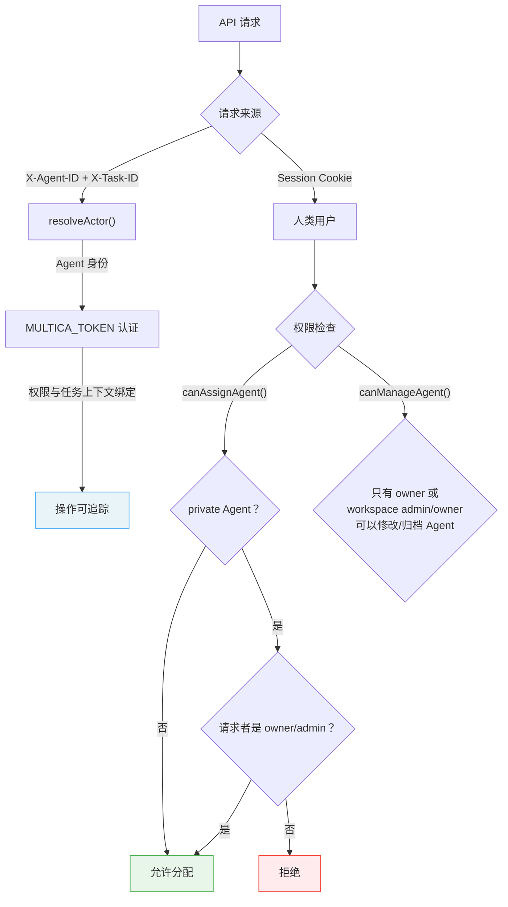

> 上图展示身份解析与权限控制流程。请求来源通过 `X-Agent-ID` / `X-Task-ID` 请求头或 Session Cookie 区分人类与 Agent。Agent 通过 `MULTICA_TOKEN` 认证，权限与任务上下文绑定。`canAssignAgent()` 检查 private Agent 只能被 owner/admin 分配，`canManageAgent()` 限制修改/归档权限。

- `canAssignAgent()`：private Agent 只能被 owner 或 workspace admin/owner 分配；archived Agent 不能被分配
- `canManageAgent()`：只有 owner 或 workspace admin/owner 可以修改/归档 Agent
- `ListAgents`：workspace 内所有成员可见所有 Agent（包括 private），但分配受权限控制

**身份解析**（`server/internal/handler/handler.go` 的 `resolveActor` 方法）：

请求来源通过 `X-Agent-ID` 和 `X-Task-ID` 请求头区分是来自人类还是 Agent。Agent 通过 `MULTICA_TOKEN` 认证，权限与任务上下文绑定。这意味着 Agent 的每一个操作都是可追踪的 —— 你知道哪个 Agent 在什么时候做了什么。

### 2.2 Unified Runtimes：五虎将的统一抽象

**Runtime 数据模型**（`server/migrations/004_agent_runtime_loop.up.sql`）：

```mermaid
erDiagram
    AGENT_RUNTIME {
        uuid id PK
        uuid workspace_id FK
        varchar runtime_mode "local / cloud"
        varchar provider "claude / codex / ..."
        varchar status "online / offline"
        uuid daemon_id FK
        varchar device_info
        jsonb metadata
        timestamp last_seen_at
    }

    AGENT {
        uuid id PK
        uuid workspace_id FK
        uuid runtime_id FK
        varchar name
        varchar status
    }

    DAEMON {
        uuid id PK
        varchar device_info
    }

    AGENT_RUNTIME ||--o{ AGENT : "hosts"
    DAEMON ||--o{ AGENT_RUNTIME : "runs"
    AGENT_RUNTIME {
        note "UNIQUE(workspace_id, daemon_id, provider)"
    }
```

> 上图展示 Runtime 数据模型的 ER 关系。每个 `agent_runtime` 记录对应一个 Daemon 进程上的一个 Provider（如 claude），通过 `UNIQUE(workspace_id, daemon_id, provider)` 约束确保同一 Daemon 上同一 Provider 只注册一次。Agent 通过 `runtime_id` 关联到具体的 Runtime 实例。

**注册流程**：

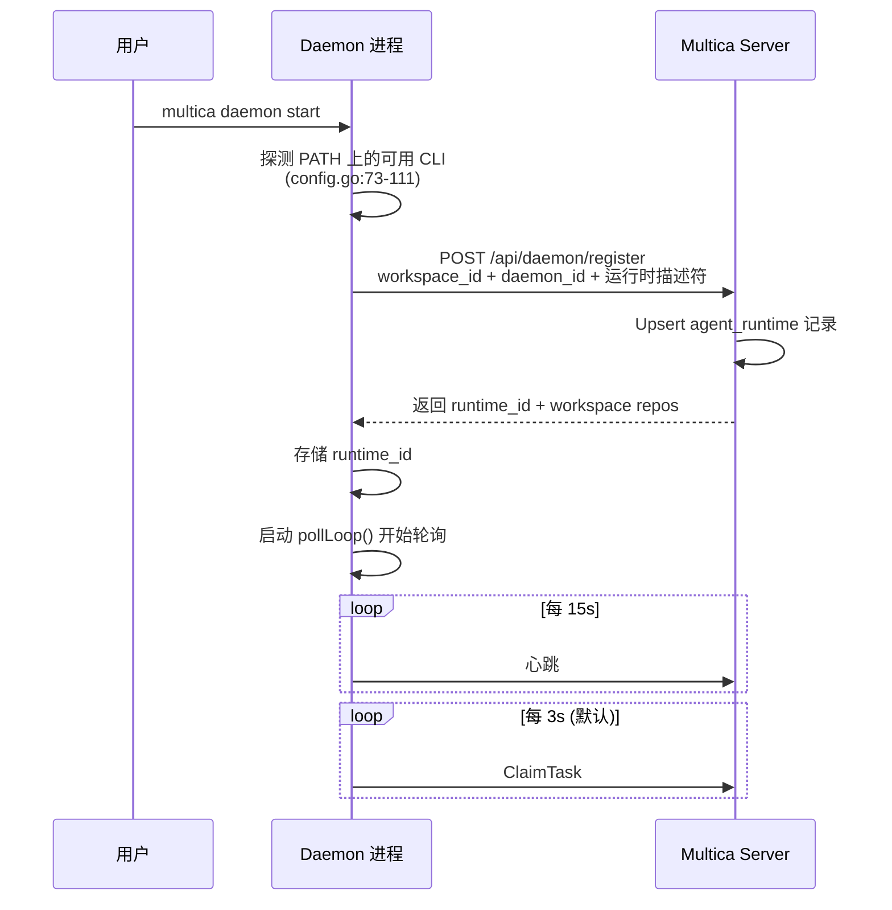

> 上图展示 Runtime 注册的时序流程。Daemon 启动时自动探测 PATH 上可用的 Agent CLI，向 Server 注册并获得 runtime_id，随后进入持续的 pollLoop 轮询和心跳循环。

**统一的 Backend 接口屏蔽了底层协议差异**：

虽然五种 Agent CLI 使用完全不同的通信协议（NDJSON、JSON-RPC 2.0、ACP），但在 Multica 层面它们都呈现为统一的 `Session{Messages, Result}` 模型。消息类型也是统一的：`text`、`thinking`、`tool-use`、`tool-result`、`status`、`error`、`log`。

**Daemon 的并发模型**（`server/internal/daemon/daemon.go`）：

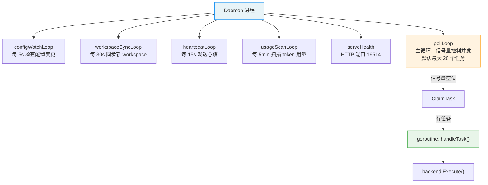

> 上图展示 Daemon 启动后运行的 6 个后台 goroutine。其中 `pollLoop` 是主循环，通过信号量控制最大并发任务数（默认 20）；`heartbeatLoop` 提供心跳让 Server 检测 Runtime 存活；`usageScanLoop` 周期性扫描 Agent 日志文件获取 token 用量。所有 goroutine 共享 Daemon 的 runtime_id 和配置。

Daemon 启动后运行多个后台 goroutine：
- `configWatchLoop`：每 5s 检查配置变更
- `workspaceSyncLoop`：每 30s 同步新 workspace
- `heartbeatLoop`：每 15s 发送心跳（Server 用这个检测 stale runtime）
- `usageScanLoop`：每 5min 扫描 Agent 日志文件获取 token 用量
- `serveHealth`：HTTP 健康检查（端口 19514）
- `pollLoop`：主循环，信号量控制并发（默认最大 20 个任务）

### 2.3 Multi-Workspace：三层隔离

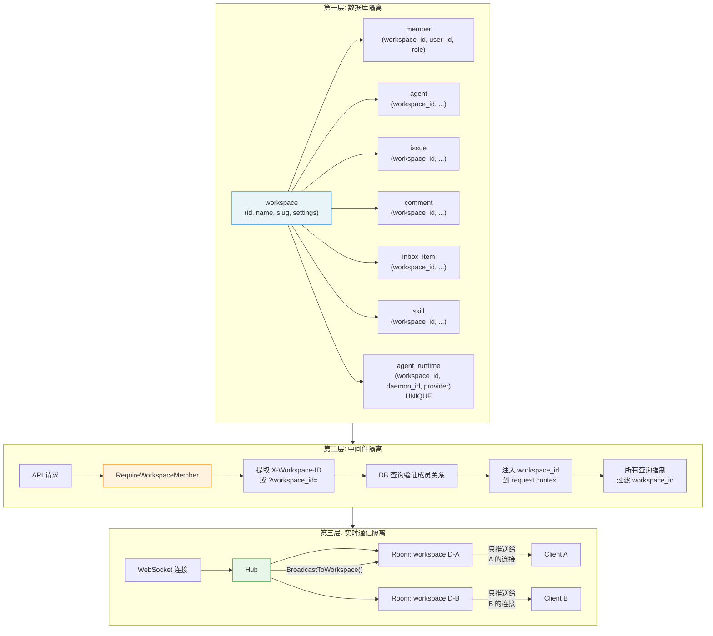

> 上图展示 Workspace 的三层隔离架构。**第一层（数据库）**：所有 workspace 作用域实体都带 `workspace_id` + `ON DELETE CASCADE`，数据在存储层面物理隔离。**第二层（中间件）**：`RequireWorkspaceMember` 中间件拦截每个 API 请求，提取 workspace ID 并验证成员关系，注入到 request context，所有数据查询强制过滤 `workspace_id`。**第三层（WebSocket）**：Hub 使用 room 概念，`BroadcastToWorkspace()` 只向同一 workspace room 内的连接推送消息。

**第一层 —— 数据库隔离**：

```sql
-- 所有 workspace 作用域实体都带 workspace_id + ON DELETE CASCADE
workspace (id, name, slug, settings, issue_prefix, context, repos)
  ├─ member (workspace_id, user_id, role)
  ├─ agent (workspace_id, owner_id, ...)
  ├─ issue (workspace_id, ...)
  ├─ comment (workspace_id, ...)
  ├─ inbox_item (workspace_id, ...)
  ├─ skill (workspace_id, ...)
  └─ agent_runtime (workspace_id, daemon_id, provider) UNIQUE
```

**第二层 —— 中间件隔离**（`server/internal/middleware/workspace.go:57`）：

所有数据查询（`GetIssueInWorkspace`、`ListIssues`、`ListAgents`）都强制过滤 `workspace_id`。`loadIssueForUser` 和 `loadAgentForUser` 辅助函数总是验证 workspace scope。

**第三层 —— 实时通信隔离**（`server/internal/realtime/hub.go:133`）：

WebSocket Hub 使用 room 概念，以 `workspaceID` 为 key。`BroadcastToWorkspace()` 只向同一 workspace room 内的连接发送消息。

**前端层面**：

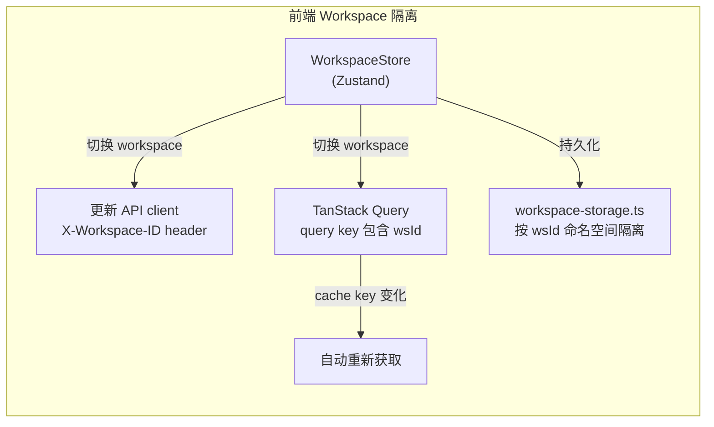

> 上图展示前端层面的 Workspace 隔离机制。`WorkspaceStore` 管理 workspace 切换，同时更新 API client 的 header 和 TanStack Query 的 cache key。由于所有 query key 都包含 `wsId`，切换 workspace 时 cache key 自动变化，触发数据重新获取，无需手动 invalidation。

### 2.4 Harness Engineering：执行环境的精密装配

Harness Engineering 在 Multica 中由 `server/internal/daemon/execenv/` 包承担，它负责为每个任务创建一个隔离、完整、可复用的执行环境。

**目录结构**（每个任务独立）：

```
{workspacesRoot}/{workspaceID}/{shortTaskID}/
  workdir/       ← Agent 的工作目录（初始为空）
  output/        ← 调试用输出
  logs/          ← 日志
  codex-home/    ← Codex 专用（如适用）
```

**装配流程**：

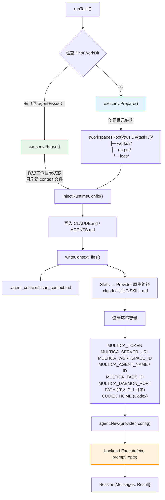

> 上图展示 Harness Engineering 的完整装配流程。核心决策点是 `PriorWorkDir` 检查：如果之前处理过同一个 Issue（同 Agent + 同 Issue），则 `Reuse()` 保留之前的代码、文件、Git 状态，只刷新 context 文件；否则 `Prepare()` 创建全新目录结构。随后依次注入运行时配置、写入 Skills、设置环境变量，最后创建 Backend 并启动 Agent CLI。

**Session 复用**（`server/migrations/020`）：

这是 Harness Engineering 的一个精妙设计。同一个 (Agent, Issue) 对上的多个任务可以复用之前的：
- `prior_session_id`：Agent CLI 的 session ID，用于恢复对话上下文
- `prior_work_dir`：之前的工作目录，代码、文件、Git 状态都保留

这意味着：当用户在 Issue 上追加评论触发新任务时，Agent 不需要从零开始 —— 它继承之前的会话上下文和工作目录状态。

### 2.5 Context Engineering：从 Prompt 到 Meta Skill

Context Engineering 是 Multica 最体现工程艺术的部分。它的核心理念是：**Prompt 要极简，上下文要丰富，让 Agent 自主发现和利用信息**。

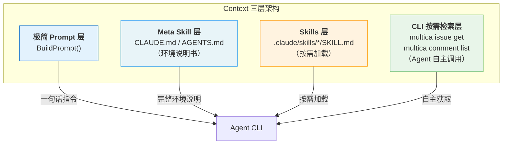

> 上图展示 Context Engineering 的四层信息架构。**Prompt 层**极简（一句话：去读 issue），**Meta Skill 层**丰富（完整的环境说明书，包含身份、命令、仓库、工作流），**Skills 层**按需加载（Agent 原生机制自动发现），**CLI 检索层**完全由 Agent 自主决策。信息量从上到下递增，但 Agent 只在需要时才访问更深层的信息，避免上下文膨胀。

**Prompt 层（极简）**：

```go
// server/internal/daemon/prompt.go:11
func BuildPrompt(task Task) string {
    // Issue 任务：一句话告诉 Agent 去读 issue
    "Your assigned issue ID is: %s. Start by running `multica issue get %s --output json`"
    // Chat 任务：附上用户消息
    "User message:\n%s"
}
```

**Meta Skill 层（丰富）**：`buildMetaSkillContent()` 生成的 CLAUDE.md / AGENTS.md 包含：

```
1. Agent Identity        ← 个性化指令（instructions 字段）
2. Available Commands    ← 完整的 CLI 命令参考
3. Repositories          ← 可用的仓库列表及 checkout URL
4. Workflow Instructions ← 根据触发类型的不同工作流
5. Skills List           ← 已安装的 Skill 名称列表
6. Mentions Format       ← mention://issue/<id> 等格式
7. Attachments           ← 附件下载说明
8. Output Guidelines     ← "简洁、结果导向"
```

**三种工作流的上下文差异**：

```mermaid
flowchart TD
    subgraph Assignment["Assignment 工作流"]
        direction LR
        A1["multica issue get"] --> A2["set in_progress"]
        A2 --> A3["checkout repo"]
        A3 --> A4["implement"]
        A4 --> A5["create PR"]
        A5 --> A6["set in_review"]
    end

    subgraph Comment["Comment Mention 工作流"]
        direction LR
        C1["multica issue get"] --> C2["comment list"]
        C2 --> C3["找到触发评论"]
        C3 --> C4["回复评论"]
        C4 --> C5["可选: 代码变更"]
    end

    subgraph Chat["Chat 工作流"]
        direction LR
        CH1["用户消息"] --> CH2["交互式对话"]
        CH2 --> CH3["使用 CLI 查询"]
        CH3 --> CH4["执行操作"]
    end
```

> 上图对比三种工作流的步骤差异。**Assignment** 最完整（读 issue → 更新状态 → 检出仓库 → 实现 → 提 PR → 更新状态）；**Comment Mention** 聚焦于读 issue + 评论 + 回复（可选代码变更）；**Chat** 是交互式对话模式。Meta Skill 中根据触发类型注入不同的工作流指令。

| 触发类型 | 工作流 |
|---------|--------|
| **Assignment** | get issue → set in_progress → checkout repo → implement → PR → set in_review |
| **Comment** | get issue → list comments → 找到触发评论 → 回复 → 可选执行代码变更 |
| **Chat** | 交互式对话模式，使用 CLI 查询和执行操作 |

**Skills 发现机制**：每种 Provider 有自己的 Skill 发现阶段。Multica 不实现自己的加载器，只负责把 Skill 文件放到正确位置：

- Claude Code 自动扫描 `.claude/skills/*/SKILL.md`
- Codex 自动扫描 `CODEX_HOME/skills/*/SKILL.md`
- OpenCode 自动扫描 `.config/opencode/skills/*/SKILL.md`

Meta Skill 中只列出 Skill 名称（如 "- **code-review**"），Agent 自己通过原生机制发现完整内容。这种"点到为止"的设计避免了上下文膨胀 —— Skill 的完整内容只有在 Agent 实际需要时才被加载。

---

## 第三部分：Task 全生命周期 —— 从用户动作到 Agent 完成

### 3.1 完整生命周期追踪

让我们跟随一个完整的场景：**用户在 Issue #117 上 @mention 一个 Agent，要求修复一个 bug**。

```mermaid
sequenceDiagram
    actor User as 用户
    participant Handler as Comment Handler
    participant EventBus as EventBus
    participant TaskSvc as TaskService
    participant DB as Database
    participant Daemon as Daemon
    participant ExecEnv as execenv
    participant AgentCLI as Agent CLI
    participant WS as WebSocket Hub
    participant Frontend as 前端

    Note over User,Frontend: Phase 1: 触发 (Trigger)
    User->>Handler: 评论 "@BackendBot 修复 redirect bug"
    Handler->>DB: 创建评论 (author_type=member)
    Handler->>EventBus: comment:created
    Handler->>TaskSvc: enqueueMentionedAgentTasks()

    Note over User,Frontend: Phase 2: 入队 (Enqueue)
    TaskSvc->>TaskSvc: 验证 Agent 存在 + Runtime 绑定
    TaskSvc->>DB: CreateAgentTask (status=queued)
    TaskSvc->>EventBus: task:dispatch

    Note over User,Frontend: Phase 3: 认领 (Claim)
    Daemon->>DB: ClaimTask (FOR UPDATE SKIP LOCKED)
    DB-->>Daemon: Task + AgentData + Skills + Repos
    Daemon->>Daemon: 任务 queued → dispatched<br/>Agent idle → working

    Note over User,Frontend: Phase 4: 环境准备 (Prepare)
    Daemon->>ExecEnv: Prepare() / Reuse()
    ExecEnv->>ExecEnv: InjectRuntimeConfig()<br/>writeContextFiles()

    Note over User,Frontend: Phase 5: 执行 (Execute)
    Daemon->>AgentCLI: backend.Execute(prompt)
    loop Think-Act-Observe 循环
        AgentCLI->>AgentCLI: 调用 multica CLI
        AgentCLI->>Daemon: Session.Messages (流式)
    end

    Note over User,Frontend: Phase 6: 流式传输 (Stream)
    Daemon->>DB: ReportTaskMessages (批量)
    DB->>EventBus: task:message
    EventBus->>WS: BroadcastToWorkspace
    WS->>Frontend: WS event: task:message
    Frontend->>Frontend: 实时渲染 Agent 操作

    Note over User,Frontend: Phase 7: 完成 (Complete)
    AgentCLI-->>Daemon: Session.Result (completed)
    Daemon->>DB: CompleteTask + 发布评论
    Daemon->>DB: 保存 session_id + work_dir
    DB->>EventBus: task:completed

    Note over User,Frontend: Phase 8: 通知 (Notify)
    EventBus->>WS: task:completed
    EventBus->>DB: 创建 inbox_item + activity_log
    WS->>Frontend: WS events
    Frontend->>Frontend: 更新 Task Card / 评论列表 / 通知
```

> 上图展示一个完整 Task 生命周期的 8 个阶段时序。从用户在 Issue 上 @mention Agent 触发任务，经过入队（`CreateAgentTask`）、认领（`ClaimTask` 使用 `FOR UPDATE SKIP LOCKED` 保证并发安全）、环境装配（`execenv` 写入配置和 Skills）、Agent 执行（CLI 子进程内部 Think-Act-Observe 循环）、流式消息传输（通过 EventBus → WebSocket → 前端实时渲染）、到最终完成（Agent 输出作为评论发布、通知订阅者）。

#### Phase 1: 触发（Trigger）

```
用户在 Issue #117 添加评论: "@BackendBot 这个登录 redirect 有 bug，请修复"
```

**系统处理**（`server/internal/handler/comment.go:365`）：
1. 创建评论记录，`author_type = 'member'`
2. `mention.ExpandIssueIdentifiers()` 自动展开 "MUL-117" 等裸引用为 mention 链接
3. 发布 `comment:created` 事件到 EventBus
4. 检测到 `@BackendBot` mention → 调用 `enqueueMentionedAgentTasks()`

#### Phase 2: 入队（Enqueue）

**TaskService.EnqueueTaskForMention()**（`server/internal/service/task.go:80`）：

```
1. 验证 Agent 存在且未归档、有 Runtime 绑定
2. CreateAgentTask SQL:
   ├─ agent_id = BackendBot 的 ID
   ├─ runtime_id = BackendBot 绑定的 runtime ID
   ├─ issue_id = Issue #117 的 ID
   ├─ priority = 依据 issue priority 转换的整数
   ├─ trigger_comment_id = 触发评论的 ID
   └─ status = 'queued'
3. 发布 task:dispatch 事件
```

SQL 层使用 `FOR UPDATE SKIP LOCKED` 确保并发安全：
```sql
-- ClaimAgentTask 使用行级锁 + SKIP LOCKED
SELECT ... FROM agent_task_queue
WHERE agent_id = $1 AND status = 'queued'
ORDER BY priority DESC, created_at ASC
FOR UPDATE SKIP LOCKED
LIMIT 1
```

#### Phase 3: 认领（Claim）

Daemon 的 `pollLoop()` 正在轮询：

```
1. pollLoop 检查信号量是否还有空位 (max_concurrent_tasks)
2. 调用 POST /api/daemon/runtimes/{runtimeId}/tasks/claim
3. Server 端 ClaimTaskForRuntime:
   ├─ 列出该 runtime 的所有 pending tasks
   ├─ 按优先级尝试 ClaimAgentTask (SKIP LOCKED)
   ├─ 加载 Agent 数据 (name, instructions, skills)
   ├─ 加载 workspace repos
   └─ 返回: Task + AgentData + Skills + Repos + PriorSessionID
4. 任务状态: queued → dispatched
5. Agent 状态: idle → working
```

#### Phase 4: 环境准备（Prepare）

**handleTask → runTask**（`server/internal/daemon/daemon.go:875`）：

```
1. 检查 PriorWorkDir:
   ├─ 有 (之前处理过同一个 issue) → execenv.Reuse()
   │   └─ 保留工作目录状态，只刷新 context 文件
   └─ 无 → execenv.Prepare()
       └─ 创建 {workspacesRoot}/{wsID}/{taskID}/
           ├─ workdir/ (空目录)
           ├─ output/
           └─ logs/

2. writeContextFiles():
   ├─ .agent_context/issue_context.md (任务上下文)
   └─ Skills → 写入 provider 原生路径
       └─ .claude/skills/code-review/SKILL.md
       └─ .claude/skills/testing/SKILL.md

3. InjectRuntimeConfig():
   └─ 写入 CLAUDE.md (或 AGENTS.md)
       ├─ Agent Identity: BackendBot 的 instructions
       ├─ Commands: multica CLI 完整参考
       ├─ Repos: 可用仓库列表
       ├─ Workflow: comment-triggered 工作流
       │   "1. multica issue get <id> --output json"
       │   "2. multica issue comment list <id> --output json"
       │   "3. 找到触发评论 (ID: xxx)"
       │   "4. multica issue comment add <id> --parent <comment-id> --content ..."
       ├─ Skills: code-review, testing
       └─ Mentions, Attachments, Output Guidelines
```

#### Phase 5: 启动执行（Execute）

```
1. BuildPrompt():
   "You are running as a local coding agent...
    Your assigned issue ID is: <uuid>
    Start by running `multica issue get <uuid> --output json`"

2. 设置环境变量 + PATH 注入

3. agent.New("claude", config) → claudeBackend

4. backend.Execute(ctx, prompt, opts):
   ├─ 启动: claude -p --output-format stream-json --strict-mcp-config
   ├─ 工作目录: {workdir}
   ├─ 模型: 来自 Agent 配置或默认
   └─ 如果有 prior_session_id: --resume {sessionID}

5. Session 启动:
   ├─ Messages channel: 流式事件
   └─ Result channel: 最终结果
```

**此时 Agent CLI 内部的 Agent Loop 开始运行**：

```
Agent 内部循环 (由 Claude Code/Codex/etc. 管理):
  Think: 分析任务，规划步骤
  Act:   调用工具 (multica CLI, 文件操作, git)
  Observe: 读取工具输出
  Repeat...
```

#### Phase 6: 消息流式传输（Stream）

**Daemon 的消息转发 goroutine**：

```
session.Messages channel → 批量累积 → ReportTaskMessages API

每条消息包含:
  seq: 自增序列号
  type: text / thinking / tool-use / tool-result / error
  content / tool / input / output: 具体内容
```

**Server 端处理**：
1. 持久化消息到数据库
2. 通过 EventBus 广播 `task:message` 事件
3. WebSocket Hub 广播到 workspace room

**前端实时渲染**：
```
WS event: task:message
  → TanStack Query cache invalidation
  → Issue 详情页的 Task Card 更新
  → 实时显示 Agent 的思考、工具调用、执行结果
```

用户在 Issue 详情页能看到 Agent 的每一步操作：正在思考什么、调用了什么工具、工具返回了什么结果。

#### Phase 7: 完成（Complete）

**Agent 完成工作后**：

```
1. Session.Result 返回:
   ├─ status: "completed" / "failed" / "blocked"
   ├─ output: Agent 的最终输出文本
   ├─ session_id: 可用于下次恢复
   ├─ usage: token 用量 (按模型分组)
   └─ duration_ms: 执行时长

2. Daemon 处理结果:
   ├─ ReportTaskUsage() → 记录 token 消耗
   └─ CompleteTask():
       ├─ 任务状态 → completed
       ├─ Agent 输出作为评论发布到 Issue
       │   (author_type = 'agent', author_id = BackendBot)
       ├─ Agent 状态 → idle (reconcileAgentStatus)
       ├─ 保存 session_id + work_dir 到数据库 (供后续恢复)
       └─ 发布 task:completed 事件

3. 事件传播:
   EventBus → Listeners:
   ├─ WebSocket: BroadcastToWorkspace(task:completed)
   ├─ Notification: 为 Issue 订阅者创建 inbox_item
   │   "BackendBot completed task on MUL-117"
   └─ Activity: 记录 activity_log
```

#### Phase 8: 通知与同步（Notify）

```
Server → WebSocket → Frontend:

1. task:completed → Issue 详情页更新 Task Card 状态
2. comment:created → 新评论出现在评论列表 (Agent 的输出)
3. agent:status → Agent 状态从 working 变为 idle
4. inbox:new → Issue 订阅者收到通知
5. activity:created → 活动日志记录
```

**Frontend 的响应**：

```
use-realtime-sync hook 订阅所有 WS 事件:
  ├─ onIssueUpdated → 精确更新 cache 中的 issue 数据
  ├─ onCommentCreated → 追加评论到 cache
  ├─ agent:status → 更新 Agent 列表和详情页
  ├─ task:completed → 更新 Task Card
  ├─ inbox:new → 触发 inbox 列表 refetch
  └─ 100ms debounce 避免 bulk 操作导致的重复更新
```

### 3.2 错误与韧性（Resilience）

```mermaid
stateDiagram-v2
    [*] --> Queued: CreateAgentTask
    Queued --> Dispatched: ClaimTask (pollLoop)
    Dispatched --> Running: StartTask (handleTask)
    Running --> Completed: CompleteTask
    Running --> Failed: FailTask / Agent 出错
    Running --> Cancelled: CancelTask (用户取消)
    Dispatched --> Failed: 超时 > 5min
    Running --> Failed: 超时 > 2.5h
    Failed --> [*]
    Completed --> [*]
    Cancelled --> [*]

    note right of Failed
        错误信息作为系统评论
        发布到 Issue，Agent 恢复 idle
    end note

    note right of Cancelled
        Daemon 每 5s 轮询检测
        context.Cancel() 终止进程
        结果丢弃不上报
    end note

    note right of Completed
        Agent 输出作为评论发布
        保存 session_id + work_dir
        Agent 恢复 idle
    end note
```

> 上图展示 Task 的完整状态机。从 `Queued` 创建，经 `ClaimTask` 变为 `Dispatched`，再经 `StartTask` 变为 `Running`。正常完成进入 `Completed`，失败/超时进入 `Failed`，用户主动取消进入 `Cancelled`。三种终态各有不同的清理逻辑：失败时发布系统评论，取消时通过 context 终止进程并丢弃结果，完成时保存 session 供后续复用。

**任务失败路径**：

```
Agent 执行出错:
  1. Session.Result.status = "failed"
  2. FailTask() → 任务状态 = failed
  3. 错误信息作为系统评论发布到 Issue
  4. Agent 状态 reconcile → idle (可接受新任务)
  5. 发布 task:failed 事件 → 通知用户
```

**取消路径**：

```
用户取消 / Issue 被重新分配:
  1. CancelTask() → 任务状态 = cancelled
  2. Daemon 每 5s 轮询 GetTaskStatus
  3. 检测到 cancelled → context.Cancel()
  4. Agent CLI 进程被终止
  5. 结果被丢弃 (不上报 complete/fail)
```

**Stale 清理**（Runtime Sweeper，每 30s）：

```mermaid
flowchart TD
    SWEEPER["Runtime Sweeper<br/>每 30s 扫描"]

    SWEEPER --> HB_CHECK{"Runtime 心跳<br/>超时 > 45s？"}
    HB_CHECK -->|"是"| OFFLINE["标记 runtime = offline"]
    OFFLINE --> ORPHAN["fail 掉孤儿任务"]

    SWEEPER --> DISP_CHECK{"Dispatched 任务<br/>超时 > 5min？"}
    DISP_CHECK -->|"是"| DISP_FAIL["标记 failed"]

    SWEEPER --> RUN_CHECK{"Running 任务<br/>超时 > 2.5h？"}
    RUN_CHECK -->|"是"| RUN_FAIL["标记 failed"]

    ORPHAN --> RECONCILE["reconcileAgentStatus()"]
    DISP_FAIL --> RECONCILE
    RUN_FAIL --> RECONCILE
    RECONCILE --> IDLE["受影响 Agent → idle"]

    style OFFLINE fill:#ffebee,stroke:#F44336
    style DISP_FAIL fill:#ffebee,stroke:#F44336
    style RUN_FAIL fill:#ffebee,stroke:#F44336
    style IDLE fill:#e8f5e9,stroke:#4CAF50
```

> 上图展示 Runtime Sweeper 的三重清理逻辑。心跳超时（> 45s，即 3 次 15s 心跳失败）标记 Runtime 下线并 fail 掉所有关联的孤儿任务；Dispatched 任务超过 5 分钟未开始执行则标记失败；Running 任务超过 2.5 小时则标记失败。所有受影响 Agent 最终通过 `reconcileAgentStatus()` 恢复 idle 状态以接受新任务。

### 3.3 三种任务类型的生命周期对比

```mermaid
flowchart TD
    subgraph Assignment["Assignment 类型"]
        direction TB
        A_TRIG["触发: 分配 Agent 到 Issue"] --> A_ENQ["EnqueueTaskForIssue()"]
        A_ENQ --> A_PROMPT["Prompt: get issue..."]
        A_PROMPT --> A_WORKFLOW["Meta Skill: 完整工作流<br/>(status 管理 + PR)"]
        A_WORKFLOW --> A_OUT["输出: Issue 评论"]
        A_OUT --> A_SESSION["Session 复用: 支持<br/>(同 agent + issue)"]
    end

    subgraph CommentMention["Comment Mention 类型"]
        direction TB
        C_TRIG["触发: @mention Agent"] --> C_ENQ["EnqueueTaskForMention()"]
        C_ENQ --> C_PROMPT["Prompt: get issue..."]
        C_PROMPT --> C_WORKFLOW["Meta Skill: 只读 + 回复"]
        C_WORKFLOW --> C_OUT["输出: Issue 评论"]
        C_OUT --> C_SESSION["Session 复用: 支持"]
    end

    subgraph Chat["Chat 类型"]
        direction TB
        CH_TRIG["触发: 发送消息给 Agent"] --> CH_ENQ["EnqueueChatTask()"]
        CH_ENQ --> CH_PROMPT["Prompt: user message: ..."]
        CH_PROMPT --> CH_WORKFLOW["Meta Skill: 交互式"]
        CH_WORKFLOW --> CH_OUT["输出: Chat 回复"]
        CH_OUT --> CH_SESSION["Session 复用: 不适用"]
    end
```

> 上图对比三种任务类型的生命周期差异。三者共享 Claim → Prepare → Execute → Stream → Complete 的核心流程，但在**触发方式**、**入队函数**、**Prompt 内容**、**Meta Skill 工作流**和**Session 复用**方面各有不同。Assignment 和 Comment Mention 都会发布 Issue 评论并支持 Session 复用，而 Chat 是独立的对话通道。

| 维度 | Assignment | Comment Mention | Chat |
|------|-----------|----------------|------|
| 触发方式 | 分配 Agent | @mention Agent | 发送消息 |
| 入队函数 | `EnqueueTaskForIssue` | `EnqueueTaskForMention` | `EnqueueChatTask` |
| Prompt | "get issue..." | "get issue..." | "user message: ..." |
| Meta Skill 工作流 | 完整 (status 管理) | 只读 + 回复 | 交互式 |
| 输出方式 | Issue 评论 | Issue 评论 | Chat 回复 |
| Session 复用 | 支持 (同 agent+issue) | 支持 | 不适用 |

---

## 结语：设计哲学的总结

```mermaid
flowchart TD
    subgraph Philosophy["Multica 五条核心设计哲学"]
        P1["1. Agent 是一等公民<br/>多态 Assignee 身份模型"]
        P2["2. Harness 管调度，Agent 管推理<br/>任务编排与推理循环分离"]
        P3["3. Context > Prompt<br/>丰富上下文环境 + 极简 Prompt"]
        P4["4. 委托而非重新实现<br/>MCP / Skills / 推理循环全部委托"]
        P5["5. 隔离是安全基础<br/>DB / Middleware / WebSocket 三层隔离"]

        P1 --> CORE["核心: AI-Native<br/>Task Management"]
        P2 --> CORE
        P3 --> CORE
        P4 --> CORE
        P5 --> CORE
    end

    style CORE fill:#e8f4f8,stroke:#2196F3,stroke-width:3px
    style P1 fill:#e3f2fd,stroke:#1976D2
    style P2 fill:#fff3e0,stroke:#FF9800
    style P3 fill:#e8f5e9,stroke:#4CAF50
    style P4 fill:#fce4ec,stroke:#E91E63
    style P5 fill:#f3e5f5,stroke:#9C27B0
```

> 上图总结 Multica 的五条核心设计哲学。它们共同指向一个目标：构建 AI-Native 的任务管理平台，让 Agent 作为团队平等成员参与协作，同时通过分层架构、上下文工程和多级隔离保证系统的可靠性、可扩展性和安全性。

Multica 的多 Agent 编排架构体现了几条核心设计哲学：

**1. Agent 是一等公民，不是工具**。多态 Assignee 设计让 Agent 拥有和人类团队成员相同的身份模型 —— 可以被分配、可以创建、可以评论、可以被 @mention。这不是"调用 AI 工具"，而是"给 AI 团队成员分配工作"。

**2. Harness 管调度，Agent 管推理**。Multica 不实现 Think-Act-Observe 循环，它实现的是任务的入队、认领、环境装配、消息转发、结果收集。推理循环完全委托给 Agent CLI。这种分层让系统天然支持多种 Agent 后端。

**3. Context Engineering 重于 Prompt Engineering**。与其写一个复杂的 prompt，不如构建一个丰富的上下文环境：CLAUDE.md/AGENTS.md 提供完整的环境说明书，Skills 提供可插拔的领域知识，CLI 提供按需的数据检索能力。Agent 在一个信息充沛的环境中自主工作。

**4. 委托而非重新实现**。MCP 委托给 Agent CLI，Skill 发现委托给 Provider 的原生机制，推理循环委托给 Agent CLI。Multica 专注于它最擅长的事：任务编排、身份管理、环境隔离和实时通信。

**5. 隔离是安全的基础**。三层 Workspace 隔离（DB/Middleware/WebSocket）、每个任务独立的执行环境、独立的认证 Token、`FOR UPDATE SKIP LOCKED` 的并发安全 —— 这些不是附加功能，而是多 Agent 系统可靠运行的前提。
