# Multica 平台架构深度分析报告

> 分析视角：Harness Engineering · Context Engineering · 业务可运营性
> 颗粒度：框架图 → Pipeline 流程图 → UML 类/函数级

---

## 术语表

| 术语 | 定义 |
|---|---|
| **Harness（执行线束）** | Agent 从任务入队到结果回写的完整执行编排基础设施，包含任务队列、Daemon、ExecEnv、Agent Backend 四层 |
| **ExecEnv（执行环境）** | Daemon 为每个任务创建的隔离工作目录，内含上下文注入文件、Skill 文件、环境变量 |
| **Skill（技能）** | Agent 可用的知识模块，由 `SKILL.md` 主文件 + 支持文件组成，写入 Provider 原生路径 |
| **Runtime（运行时）** | Agent 的执行载体，`local` 模式由本地 Daemon 轮询领取任务，`cloud` 模式为云端执行 |
| **Meta Skill** | 写入 `CLAUDE.md` / `AGENTS.md` 的运行时配置文件，是 Agent 发现环境的入口 |
| **PAT（Personal Access Token）** | `mul_` 前缀的个人访问令牌，通过 SHA-256 hash 查找数据库记录认证 |
| **Event Bus** | 进程内同步事件总线（`events.Bus`），类型优先 + 全局 handler，单个 panic 不影响其他 |
| **WS Hub** | 按 workspace 分房间的 WebSocket 连接管理器，支持 `BroadcastToWorkspace`、`SendToUser`、`Broadcast` 三级分发 |
| **多态指派（Polymorphic Assignee）** | Issue 的 `assignee_type` + `assignee_id` 组合，可以是 `member` 或 `agent` |
| **Token Usage（令牌用量）** | 按 (runtime, date, provider, model) 维度记录的 input/output/cache token 消耗 |

---

# 第一部分：框架层 — 宏观架构

## 1.1 系统全局架构

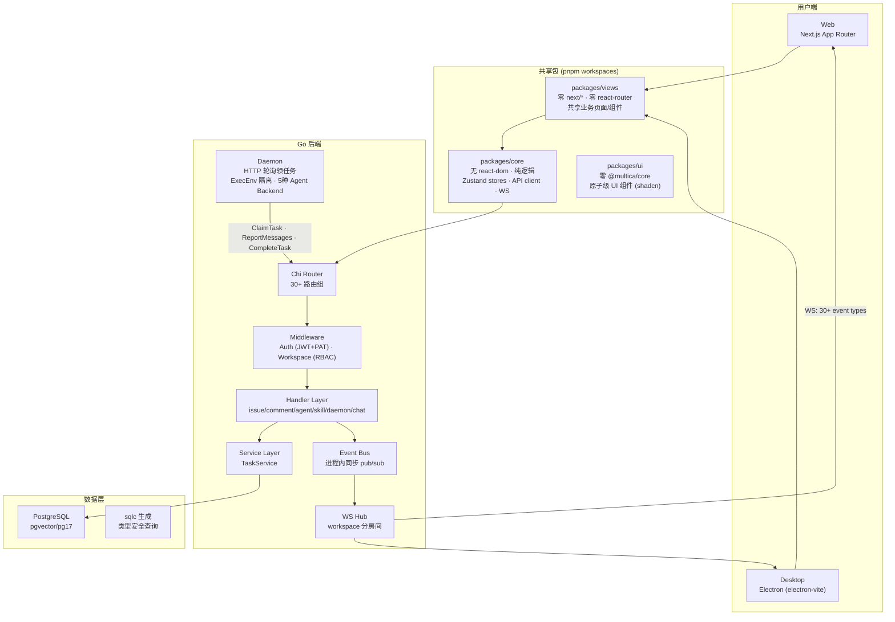

> 上图展示了从用户端到数据层的完整架构：前端通过共享包（core + views + ui）构建，后端 Go 服务通过 Chi 路由 + 中间件 + Handler + Service 四层处理请求，Daemon 作为独立的本地进程通过 HTTP 轮询与后端交互。Event Bus 解耦 Handler 和 WS 广播。

## 1.2 三条分析线索的定位

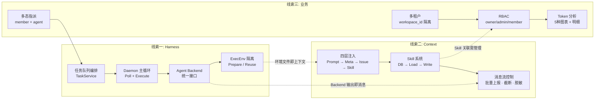

> 三条线索的交汇点是 **Agent**：Harness 解决 Agent "怎么跑"，Context 解决 "跑什么信息"，业务管理解决 "跑得怎么样"。

---

# 第二部分：Pipeline 层 — 数据流转

## 2.1 [Harness] 任务完整生命周期

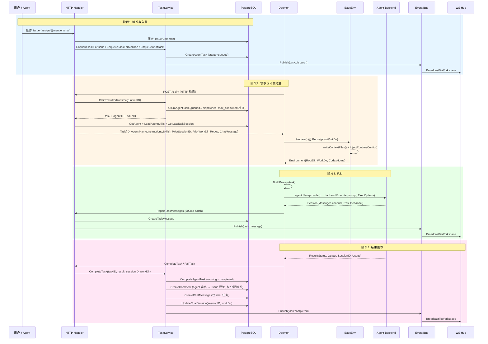

> 核心设计决策：
> - **入队时不存上下文快照**（`service/task.go:33-35` 注释），Agent 运行时通过 `multica` CLI 自主拉取最新数据
> - **并发控制**通过 `CountRunningTasks` vs `MaxConcurrentTasks` 实现（`service/task.go:177`）
> - **Session 恢复**通过 `GetLastTaskSession` 查询 (agent, issue) 对的上次 session，传递 `PriorSessionID` + `PriorWorkDir`

## 2.2 [Context] 四层上下文注入 Pipeline

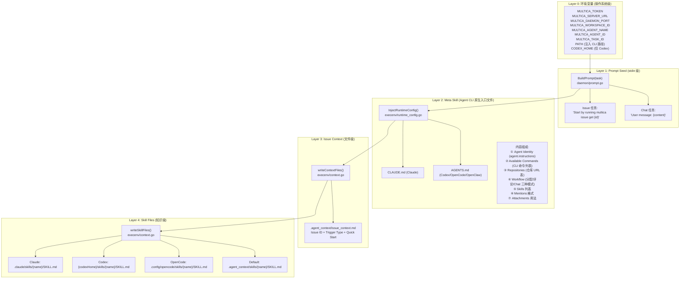

> 上下文注入的层次从操作系统环境变量到知识文件逐层细化。Layer 2 的 Meta Skill 是最关键的一层——它是 Agent CLI 的原生入口文件（Claude 读 `CLAUDE.md`，Codex 读 `AGENTS.md`），决定了 Agent 如何"发现"自己能做什么。

## 2.3 [业务] 多租户请求隔离 Pipeline

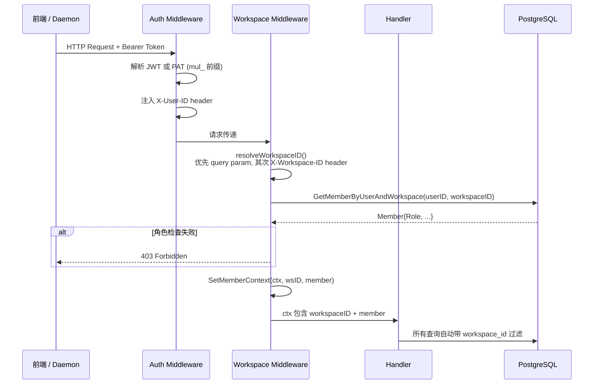

> 多租户隔离的核心机制：每个请求通过中间件链 `Auth → Workspace` 注入 `workspaceID` 和 `member`，所有后续数据库查询通过 `workspace_id` 外键实现行级隔离。

## 2.4 [通信协议] WS 事件分发 Pipeline

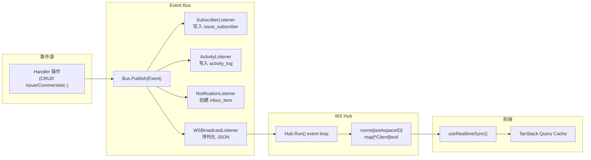

> Event Bus 是 Handler 和实时通信之间的解耦层。同一事件被 4 类 listener 并行处理：订阅管理、活动日志、通知分发、WS 广播。前端 `useRealtimeSync()` 接收 WS 事件后仅做 Query Cache 失效（不做直接数据写入），保证 TanStack Query 作为唯一的服务端状态源。

---

# 第三部分：模块层 — 组件职责与接口

## 3.1 [Harness] 核心类关系

```mermaid
classDiagram
    class Daemon {
        -cfg Config
        -client Client
        -repoCache Cache
        -workspaces map~string~workspaceState
        -runtimeIndex map~string~Runtime
        +New(cfg, logger) Daemon
        +Run(ctx) error
        -pollLoop(ctx)
        -runTask(ctx, task, provider, logger) TaskResult, error
        -handleResult(ctx, task, result)
        -loadWatchedWorkspaces(ctx) error
        -configWatchLoop(ctx)
        -handleUpdate(ctx)
    }

    class Client {
        +Token() string
        +ClaimTask(ctx, runtimeID) Task
        +StartTask(ctx, taskID) error
        +CompleteTask(ctx, taskID, result, sessionID, workDir) error
        +FailTask(ctx, taskID, errMsg) error
        +ReportTaskMessages(ctx, taskID, messages) error
        +ReportUsage(ctx, taskID, usage) error
    }

    class TaskService {
        +Queries db.Queries
        +Hub realtime.Hub
        +Bus events.Bus
        +EnqueueTaskForIssue(ctx, issue, commentID) AgentTaskQueue
        +EnqueueTaskForMention(ctx, issue, agentID, commentID) AgentTaskQueue
        +EnqueueChatTask(ctx, chatSession) AgentTaskQueue
        +ClaimTask(ctx, agentID) AgentTaskQueue
        +ClaimTaskForRuntime(ctx, runtimeID) AgentTaskQueue
        +StartTask(ctx, taskID) AgentTaskQueue
        +CompleteTask(ctx, taskID, result, sessionID, workDir) AgentTaskQueue
        +FailTask(ctx, taskID, errMsg) AgentTaskQueue
        +CancelTask(ctx, taskID) AgentTaskQueue
        +ReconcileAgentStatus(ctx, agentID)
        +LoadAgentSkills(ctx, agentID) AgentSkillData
    }

    class ExecEnv {
        +RootDir string
        +WorkDir string
        +CodexHome string
        +Prepare(params, logger) Environment, error
        +Reuse(workDir, provider, task, logger) Environment
        +Cleanup(removeAll bool) error
    }

    Daemon --> Client : HTTP 调用
    Daemon --> ExecEnv : 创建/复用环境
    Client ..> TaskService : 间接调用(通过 Handler)
    TaskService --> "db.Queries" : 数据库操作
```

> `Daemon` 是 Harness 的编排核心：通过 `Client` 与后端 HTTP 通信，通过 `ExecEnv` 管理隔离环境。`TaskService` 是服务端的任务管理中枢，封装了入队、领取、完成、失败等所有状态转换逻辑。

## 3.2 [Harness] Agent Backend 统一接口

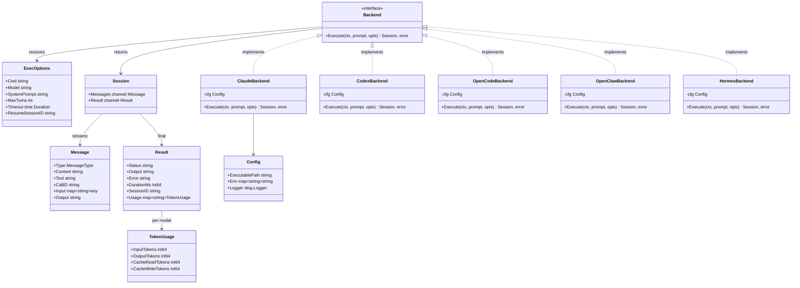

> `Backend` 接口是 Harness 对不同 Agent CLI 的抽象。五种后端共享同一个接口，新增 Agent 类型只需实现 `Execute` 方法。`Session` 的双通道设计（Messages 流式 + Result 最终）解耦了实时展示和最终结果。

## 3.3 [Context] 上下文构建函数关系

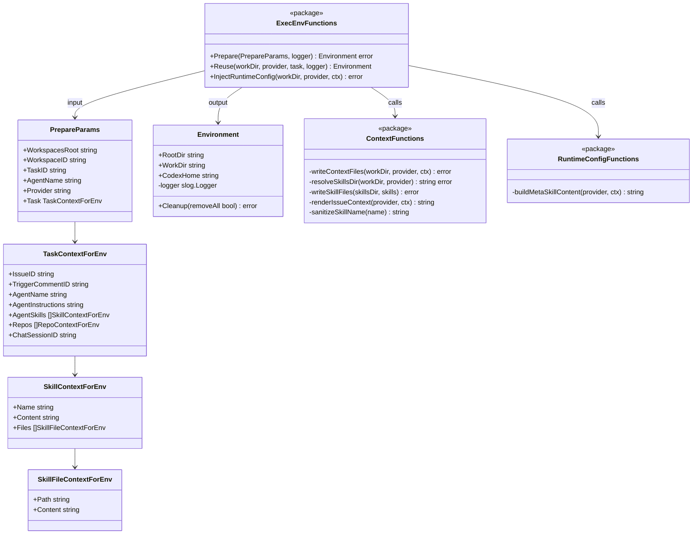

> 上下文构建的核心数据流：`TaskContextForEnv` 携带所有上下文原材料，`Prepare()` 编排整个注入过程（`writeContextFiles` 写文件 → `InjectRuntimeConfig` 写 Meta Skill），最终产生 `Environment`。`Reuse()` 路径复用已有 workdir 并刷新上下文文件。

## 3.4 [业务] 多租户中间件类关系

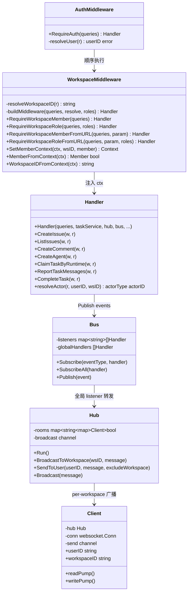

> 请求处理链：`Auth → Workspace → Handler → Bus → Hub → Client`。`WorkspaceMiddleware` 的四种变体对应不同的 ID 解析方式（query param vs URL param）和角色要求。`Handler.resolveActor` 通过 `X-Agent-ID` header 区分人和 Agent 的操作身份。

## 3.5 [业务] 前端实时同步机制

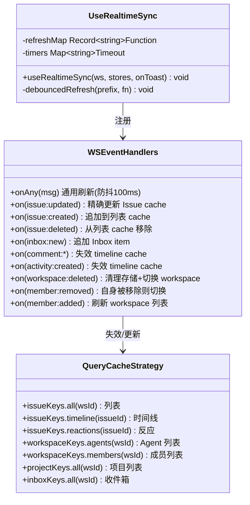

> 前端实时同步的核心模式：**WS 事件作为失效信号，不做直接数据写入**。`onAny` 对通用事件按 prefix 防抖 100ms 批量失效；特定事件（issue CRUD、comment、activity）有精确的 cache 更新逻辑。Reconnect 后全量 refetch 恢复。

---

# 第四部分：函数级深入分析

## 4.1 [Harness] Daemon.runTask — 执行编排核心

**文件**: `server/internal/daemon/daemon.go:875-988`

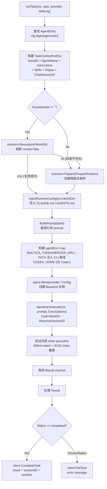

> `runTask` 是 Harness 的编排核心函数。关键决策点：
> 1. **环境复用优先**：先尝试 `Reuse(priorWorkDir)`，失败才走 `Prepare()`
> 2. **环境不清理**：注释明确说明 workdir 保留用于未来同 (agent, issue) 对的任务复用
> 3. **PATH 注入**：将 `multica` CLI 所在目录 prepend 到 PATH，确保 Agent 子进程能调用

## 4.2 [Harness] TaskService.ClaimTaskForRuntime — 任务领取与并发控制

**文件**: `server/internal/service/task.go:204-228`

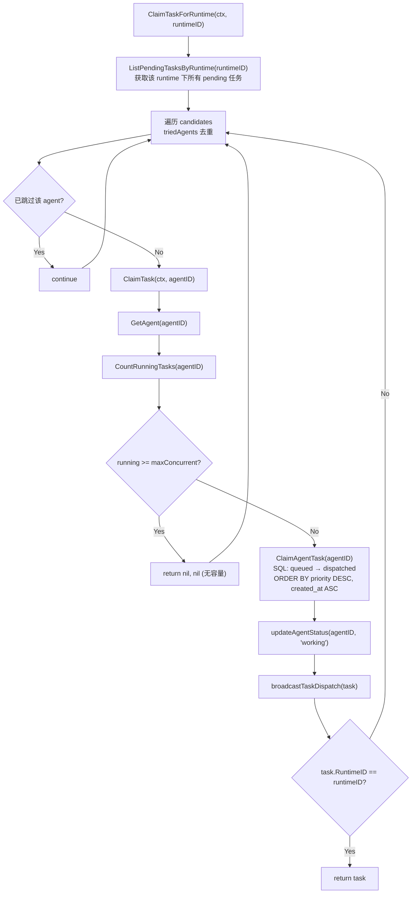

> 并发控制的关键设计：`ClaimTaskForRuntime` 遍历该 runtime 下所有 pending 任务，对每个 candidate 的 agent 检查 `CountRunningTasks` 是否达到 `MaxConcurrentTasks`。只有未达上限的 agent 才能领取任务。`triedAgents` map 确保同一 agent 不会被重复检查。

## 4.3 [Context] buildMetaSkillContent — 上下文注入的核心构建函数

**文件**: `server/internal/daemon/execenv/runtime_config.go:33-178`

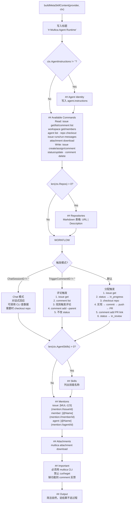

> `buildMetaSkillContent` 是上下文工程的"心脏"：根据三种触发模式（分配、评论、Chat）生成不同的工作流指引。这个函数决定了 Agent 在拿到任务后遵循什么流程。

## 4.4 [业务] Daemon.ClaimTaskByRuntime — 服务端领取响应组装

**文件**: `server/internal/handler/daemon.go:224-309`

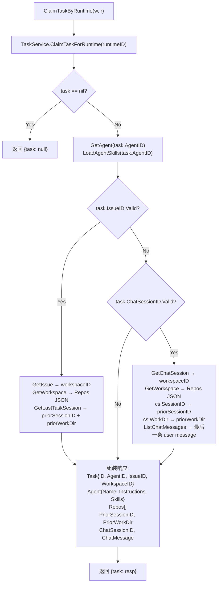

> 服务端领取响应的组装逻辑是 Context 工程的数据源头：从 `Agent` 表加载 instructions 和 skills，从 `Workspace` 表加载 repos，从 `agent_task_queue` 表恢复 session 信息，从 `chat_message` 表加载最新用户消息。这些数据随后被 Daemon 传递给 ExecEnv 进行文件注入。

## 4.5 [通信协议] 消息 drain 与批量上报

**文件**: `server/internal/daemon/daemon.go:990-1118`

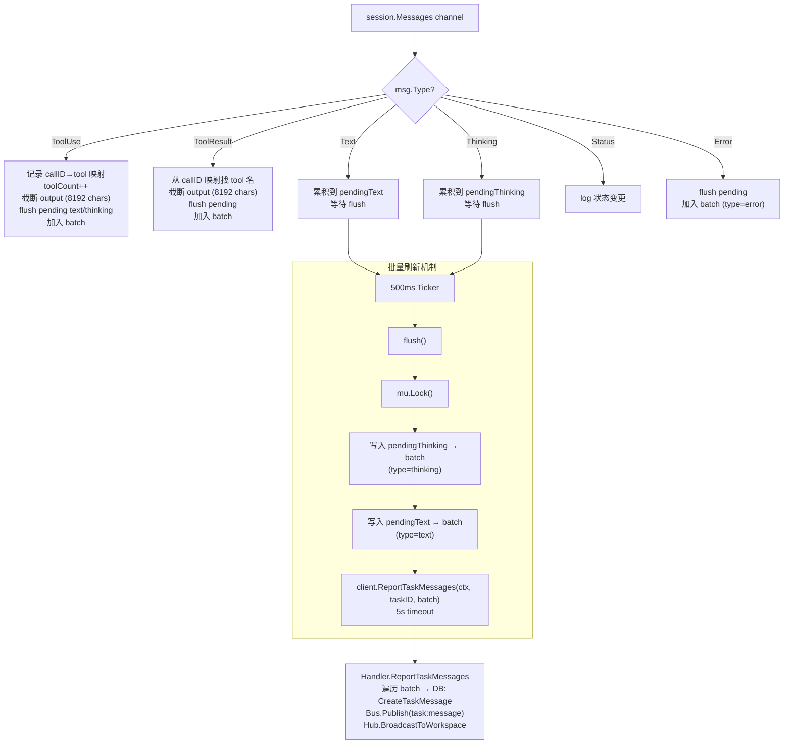

> 消息 drain 的关键设计：
> 1. **累积 + 定时刷新**：text/thinking 消息累积后每 500ms 刷新一次，避免高频小消息
> 2. **截断**：工具输出超过 8192 字符截断，防止 DB 存储膨胀
> 3. **顺序保证**：通过 `seq` 原子计数器保证消息顺序
> 4. **超时隔离**：`ReportTaskMessages` 用独立 5s timeout context，不阻塞主流程

---

# 第五部分：三条线索的交叉分析与能力矩阵

## 5.1 已有能力矩阵

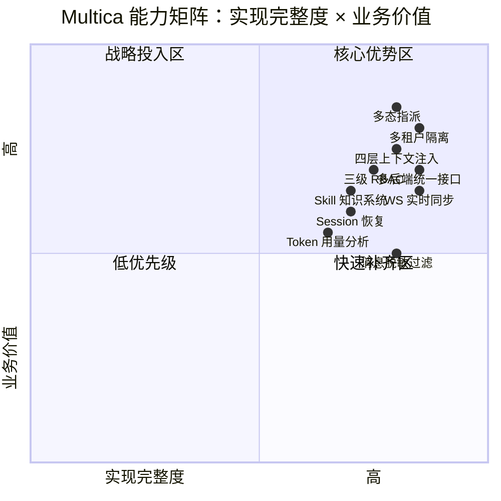

## 5.2 关键空白与建设路径

| 维度 | 已有 | 缺失 | 建设路径 |
|---|---|---|---|
| **Harness** | 任务队列 + 并发控制 + 5种 Backend | 无优先级调度、无依赖链、无自动重试、无容器隔离 | 短期: 任务优先级 + 重试策略; 中期: DAG 依赖编排; 长期: 容器沙箱 |
| **Context** | 四层注入 + Skill + Session 恢复 | 无 RAG/向量检索、无长期记忆、无上下文预算管理 | 短期: Token 预算管理; 中期: pgvector 向量索引 + embedding pipeline; 长期: Agent 长期知识库 |
| **业务** | RBAC + Token 分析 + 多态指派 | 无 Billing/配额、无全局仪表盘、无 Agent 效能报告、无审计 UI | 短期: Workspace 聚合仪表盘 (API 已就绪) + Agent 效能报告; 中期: Billing engine; 长期: 审计合规 |

## 5.3 数据资产盘点

| 数据表 | 已利用 | 未暴露 |
|---|---|---|
| `agent_task_queue` | 任务 CRUD + 状态流转 | 成功率/平均耗时/趋势分析 |
| `task_message` | 实时展示 + Issue Timeline | 工具调用频率/Agent 行为分析 |
| `runtime_usage` | Runtime 级 Token 图表 | Workspace 级成本聚合、Issue 级成本归因 |
| `activity_log` | Issue Timeline 展示 | 独立审计 UI、用户活跃度分析 |
| `workspace.repos` | Agent 注入可用仓库列表 | 仓库活跃度、Agent 代码贡献统计 |
| `chat_session` + `chat_message` | Chat 交互 | 会话质量分析、Agent 响应时间 |
| `agent.instructions` | Meta Skill 注入 | 指令模板市场、最佳实践推荐 |

---

# 附录：关键文件索引

## Harness 层

| 文件 | 职责 |
|---|---|
| `server/internal/daemon/daemon.go` | Daemon 主循环、任务编排、消息 drain |
| `server/internal/daemon/types.go` | Task/Agent/Skill/TaskResult 类型定义 |
| `server/internal/daemon/prompt.go` | BuildPrompt — 极简引导 prompt |
| `server/internal/daemon/execenv/execenv.go` | Prepare/Reuse/Cleanup — 环境生命周期 |
| `server/internal/daemon/execenv/context.go` | writeContextFiles — 上下文文件写入 |
| `server/internal/daemon/execenv/runtime_config.go` | InjectRuntimeConfig — Meta Skill 生成 |
| `server/pkg/agent/agent.go` | Backend 接口 + Message/Result/TokenUsage 类型 |
| `server/pkg/agent/claude.go` | Claude Code 后端 |
| `server/pkg/agent/codex.go` | Codex 后端 |
| `server/internal/service/task.go` | TaskService — 服务端任务管理中枢 |
| `server/internal/handler/daemon.go` | Daemon API (heartbeat/claim/messages/usage) |

## Context 层

| 文件 | 职责 |
|---|---|
| `server/internal/daemon/execenv/runtime_config.go` | buildMetaSkillContent — Agent 环境说明 |
| `server/internal/daemon/execenv/context.go` | renderIssueContext + writeSkillFiles |
| `server/internal/handler/skill.go` | Skill CRUD + ClawHub/skills.sh 导入 |
| `server/pkg/redact/redact.go` | 敏感信息过滤 |
| `server/internal/mention/expand.go` | Issue 标识符链接扩展 |

## 业务/通信层

| 文件 | 职责 |
|---|---|
| `server/internal/middleware/workspace.go` | 多租户中间件 (Member + Role) |
| `server/internal/middleware/auth.go` | 认证中间件 (JWT + PAT) |
| `server/internal/events/bus.go` | 进程内 Event Bus |
| `server/internal/realtime/hub.go` | WS Hub — workspace 分房间 |
| `server/pkg/protocol/events.go` | 30+ WS 事件类型常量 |
| `packages/core/realtime/use-realtime-sync.ts` | 前端 WS→Cache 失效同步 |
| `packages/core/workspace/store.ts` | Workspace 切换 + TanStack Query 缓存隔离 |
| `packages/core/workspace/queries.ts` | workspaceKeys — 缓存 key 定义 |
| `packages/views/settings/components/` | Settings 页面 (6 标签) |
| `packages/views/agents/components/` | Agent 管理 (4 标签) |
| `packages/views/runtimes/components/` | Runtime 管理 + Token 分析 |
